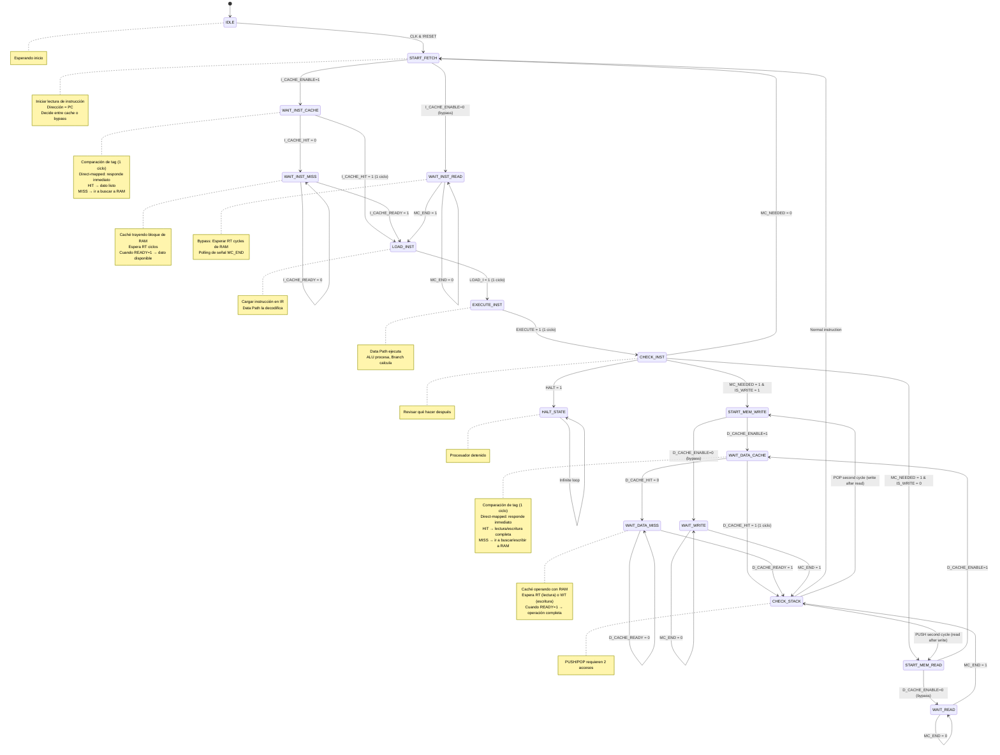

# Control Unit (Unidad de Control)

**Tipo**: Componente de Control Principal
**Estado**: ✅ IMPLEMENTADO (Actualizado 2025-12-13)
**Ubicación**: Circuit "Control Unit" + "FSM" en s-mips.circ
**Complejidad**: ⭐⭐⭐ Tricky
**Prioridad**: ✅ COMPLETADO

## ✅ ESTADO: IMPLEMENTADO

**ESTE COMPONENTE ESTÁ IMPLEMENTADO - EL PROCESADOR FUNCIONA**

El Control Unit es el cerebro del procesador. Orquesta TODAS las operaciones:
- ✅ Cuándo cargar instrucciones
- ✅ Cuándo ejecutarlas
- ✅ Cuándo acceder a memoria
- ✅ Cuándo escribir resultados

**Control Unit implementado = Componentes coordinados = Procesador funcional ✅**

## Descripción

La Control Unit es una máquina de estados finitos (FSM) que coordina el ciclo de ejecución de instrucciones. Es el director de orquesta que sincroniza [[Data Path]], [[Memory Control]] y todos los demás componentes.

## Responsabilidades

1. **Fetch de Instrucciones**: Iniciar lectura de instrucción desde memoria
2. **Sincronización con RAM**: Esperar RT cycles de la RAM asíncrona
3. **Carga de Instrucción**: Activar LOAD_I para cargar en [[Instruction Register]]
4. **Ejecución**: Activar EXECUTE para que [[Data Path]] procese
5. **Acceso a Memoria**: Coordinar LW/SW/PUSH/POP con [[Memory Control]]
6. **Detención**: Responder a señal HALT

## Máquina de Estados

### Estados Principales

**Nota sobre cachés direct-mapped**: Se agregaron **4 estados** para soporte de cachés:
- `WAIT_INST_CACHE` y `WAIT_INST_MISS` para Instruction Cache
- `WAIT_DATA_CACHE` y `WAIT_DATA_MISS` para Data Cache

Estos estados solo se usan cuando las cachés están habilitadas. Con cachés deshabilitadas (`I_CACHE_ENABLE=0`, `D_CACHE_ENABLE=0`), el FSM usa los caminos originales directos a Memory Control.



### Tabla de Transiciones

**Nota**: Las filas marcadas con 🔵 son para cuando cachés están habilitadas. Direct-mapped cache responde HIT/MISS en 1 ciclo.

| Estado Actual       | Condición                  | Próximo Estado      | Señales Activas              |
| ------------------- | -------------------------- | ------------------- | ---------------------------- |
| IDLE                | CLK=1, RESET=0             | START_FETCH         | -                            |
| START_FETCH         | I_CACHE_ENABLE=1           | WAIT_INST_CACHE 🔵  | I_CACHE_REQ=1                |
| START_FETCH         | I_CACHE_ENABLE=0           | WAIT_INST_READ      | START_MC=1, R/W=0            |
| WAIT_INST_CACHE 🔵  | I_CACHE_HIT=1              | LOAD_INST           | - (dato listo en 1 ciclo)    |
| WAIT_INST_CACHE 🔵  | I_CACHE_HIT=0              | WAIT_INST_MISS      | - (cache va a RAM)           |
| WAIT_INST_MISS 🔵   | I_CACHE_READY=0            | WAIT_INST_MISS      | - (esperando RAM)            |
| WAIT_INST_MISS 🔵   | I_CACHE_READY=1            | LOAD_INST           | - (dato de RAM listo)        |
| WAIT_INST_READ      | MC_END=0                   | WAIT_INST_READ      | -                            |
| WAIT_INST_READ      | MC_END=1                   | LOAD_INST           | -                            |
| LOAD_INST           | -                          | EXECUTE_INST        | LOAD_I=1                     |
| EXECUTE_INST        | -                          | CHECK_INST          | EXECUTE=1                    |
| CHECK_INST          | HALT=1                     | HALT_STATE          | -                            |
| CHECK_INST          | MC_NEEDED=1, IS_WRITE=1    | START_MEM_WRITE     | -                            |
| CHECK_INST          | MC_NEEDED=1, IS_WRITE=0    | START_MEM_READ      | -                            |
| CHECK_INST          | MC_NEEDED=0                | START_FETCH         | -                            |
| START_MEM_WRITE     | D_CACHE_ENABLE=1           | WAIT_DATA_CACHE 🔵  | D_CACHE_WRITE_REQ=1          |
| START_MEM_WRITE     | D_CACHE_ENABLE=0           | WAIT_WRITE          | START_MC=1, R/W=1            |
| START_MEM_READ      | D_CACHE_ENABLE=1           | WAIT_DATA_CACHE 🔵  | D_CACHE_READ_REQ=1           |
| START_MEM_READ      | D_CACHE_ENABLE=0           | WAIT_READ           | START_MC=1, R/W=0            |
| WAIT_DATA_CACHE 🔵  | D_CACHE_HIT=1              | CHECK_STACK         | - (operación en 1 ciclo)     |
| WAIT_DATA_CACHE 🔵  | D_CACHE_HIT=0              | WAIT_DATA_MISS      | - (cache va a RAM)           |
| WAIT_DATA_MISS 🔵   | D_CACHE_READY=0            | WAIT_DATA_MISS      | - (esperando RAM)            |
| WAIT_DATA_MISS 🔵   | D_CACHE_READY=1            | CHECK_STACK         | - (dato/escritura completa)  |
| WAIT_WRITE          | MC_END=0                   | WAIT_WRITE          | -                            |
| WAIT_WRITE          | MC_END=1                   | CHECK_STACK         | -                            |
| WAIT_READ           | MC_END=0                   | WAIT_READ           | -                            |
| WAIT_READ           | MC_END=1                   | CHECK_STACK         | -                            |
| CHECK_STACK         | !PUSH, !POP                | START_FETCH         | -                            |
| CHECK_STACK         | PUSH (1st cycle done)      | START_MEM_READ      | PUSH_LOAD=1                  |
| CHECK_STACK         | POP (1st cycle done)       | START_MEM_WRITE     | -                            |
| HALT_STATE          | Always                     | HALT_STATE          | -                            |

## Entradas

### Desde Sistema
| Puerto | Ancho | Descripción |
|--------|-------|-------------|
| `CLK` | 1 bit | Reloj del sistema |
| `RESET` | 1 bit | Reset sincrónico |

### Desde [[Data Path]]
| Puerto        | Ancho | Descripción                               |
| ------------- | ----- | ----------------------------------------- |
| [[HALT]]      | 1 bit | Señal de instrucción HALT                 |
| [[MC_NEEDED]] | 1 bit | Indica que se necesita acceso a memoria (LW/SW/PUSH/POP)   |
| [[IS_WRITE]]  | 1 bit | Tipo de acceso: 0=lectura (LW/POP), 1=escritura (SW/PUSH)    |
| `PUSH`        | 1 bit | Señal de instrucción PUSH (para 2º ciclo de stack) |
| `POP`         | 1 bit | Señal de instrucción POP (para 2º ciclo de stack)  |

**Nota**: Estas señales son generadas por el [[Instruction Decoder]] dentro del Data Path y expuestas como salidas del Data Path hacia Control Unit.

### Desde [[Memory Control]]
| Puerto | Ancho | Descripción |
|--------|-------|-------------|
| [[MC_END]] | 1 bit | Memory Control ha terminado operación |

### Desde [[Cache System Overview|Cache System]] (Opcional)

| Puerto | Ancho | Descripción | Requerido |
|--------|-------|-------------|-----------|
| `I_CACHE_HIT` | 1 bit | Instruction Cache hit (1=hit, 0=miss). Direct-mapped → responde en 1 ciclo | ✅ Si I_CACHE_ENABLE=1 |
| `I_CACHE_READY` | 1 bit | Instruction Cache tiene dato listo para leer (solo relevante si hubo MISS) | ✅ Si I_CACHE_ENABLE=1 |
| `D_CACHE_HIT` | 1 bit | Data Cache hit (1=hit, 0=miss). Direct-mapped → responde en 1 ciclo | ✅ Si D_CACHE_ENABLE=1 |
| `D_CACHE_READY` | 1 bit | Data Cache tiene dato listo para leer (solo relevante si hubo MISS) | ✅ Si D_CACHE_ENABLE=1 |

**Nota sobre Cachés Direct-Mapped**:
- Las cachés responden **en 1 ciclo** si hay HIT o MISS (comparación de tag)
- **Si HIT**: Dato disponible inmediatamente (1 ciclo total)
- **Si MISS**: Caché va a Memory Control → toma RT/WT ciclos adicionales → `READY=1` cuando termina

**Timing**:
- `CACHE_HIT` se evalúa después de 1 ciclo de comparación de tag
- `CACHE_READY` se pone a 1 cuando: (a) hubo hit (inmediato), o (b) miss completó fetch de RAM

## Salidas

### Hacia [[Data Path]]

#### Señales de Control Principales:

| Puerto | Ancho | Descripción | Estado |
|--------|-------|-------------|--------|
| [[LOAD_I]] | 1 bit | Carga instrucción en [[Instruction Register]] (Data Path lo recibe como `LOAD_INST`) | ✅ NECESARIO |
| `EN` | 1 bit | Enable general del Data Path (habilitar procesamiento) | ✅ NECESARIO |
| `CLK` | 1 bit | Reloj global del sistema | ✅ GLOBAL |
| `RESET` | 1 bit | Reset sincrónico global | ✅ GLOBAL |

**Total: 4 señales (2 de control + 2 globales)**

**Nota de nomenclatura**: Control Unit genera `LOAD_I`, pero Data Path lo recibe como `LOAD_INST`. Son el mismo pin físico con diferente nombre por claridad en documentación.

#### Señales Opcionales (Revisar necesidad en implementación):

| Puerto | Ancho | Descripción | Análisis |
|--------|-------|-------------|----------|
| [[EXECUTE]] | 1 bit | Habilita ejecución explícita en Data Path | ⚠️ **REVISAR**: ¿Data Path ejecuta automáticamente cuando `EN=1` y hay instrucción cargada, o necesita pulso `EXECUTE` explícito? |
| `PUSH_LOAD` | 1 bit | Indica 2º ciclo de PUSH (cargar después de escribir) | ⚠️ **REVISAR**: ¿Realmente necesario? PUSH puede manejarse internamente en FSM sin señal hacia Data Path |

**⚠️ IMPORTANTE - Verificar en Logisim**:

Estas señales aparecen en la FSM de Control Unit pero **NO están documentadas como entradas** en Data Path. Hay dos posibilidades:

1. **Si son necesarias**: Agregar `EXECUTE` y `PUSH_LOAD` como entradas en Data Path.md
2. **Si NO son necesarias**: Eliminar `EXECUTE` y `PUSH_LOAD` de esta documentación

**Recomendación temporal**: Verificar implementación real en Logisim para determinar si estos pines existen físicamente.

### Hacia [[Memory Control]]
| Puerto | Ancho | Descripción |
|--------|-------|-------------|
| [[START_MC]] | 1 bit | Inicia operación en Memory Control |
| `R/W` | 1 bit | Tipo de operación: 0=read, 1=write |

### Hacia [[Cache System Overview|Cache System]] (Opcional)

| Puerto | Ancho | Descripción | Requerido |
|--------|-------|-------------|-----------|
| `I_CACHE_REQ` | 1 bit | Request a Instruction Cache (iniciar fetch de instrucción) | ✅ Si I_CACHE_ENABLE=1 |
| `D_CACHE_READ_REQ` | 1 bit | Request de lectura a Data Cache (LW/POP) | ✅ Si D_CACHE_ENABLE=1 |
| `D_CACHE_WRITE_REQ` | 1 bit | Request de escritura a Data Cache (SW/PUSH) | ✅ Si D_CACHE_ENABLE=1 |

**Nota sobre Cachés**: Estas señales solo se activan cuando las cachés están habilitadas. En modo bypass (`I_CACHE_ENABLE=0` o `D_CACHE_ENABLE=0`), estas señales permanecen en 0 y el sistema usa `START_MC` directamente.

## Timing de Instrucciones

**Nota**: Los timings asumen cachés deshabilitadas (bypass mode). Ver sección "Timing con Cachés" más abajo para timings con cachés habilitadas.

### Instrucción Normal (sin memoria) - SIN CACHÉS
```
Ejemplo: ADD R1, R2, R3

Ciclo 1: START_FETCH → WAIT_INST_READ
Ciclos 2-N: WAIT_INST_READ (N = RT cycles)
Ciclo N+1: LOAD_INST (LOAD_I=1)
Ciclo N+2: EXECUTE_INST (EXECUTE=1)
Ciclo N+3: CHECK_INST → START_FETCH

Total: 3 + RT cycles (típicamente 3 + 3 = 6 ciclos)
```

### Instrucción con Memoria (LW)
```
Ejemplo: LW R5, 0(R10)

Ciclos 1-(RT+3): Fetch de instrucción (igual que arriba)
Ciclo RT+4: START_MEM_READ
Ciclos RT+5-(RT+4+RT): WAIT_READ
Ciclo 2*RT+5: CHECK_STACK → START_FETCH

Total: 5 + 2*RT cycles
```

### Instrucción con Memoria (SW)
```
Ejemplo: SW R5, 0(R10)

Ciclos 1-(RT+3): Fetch de instrucción
Ciclo RT+4: START_MEM_WRITE
Ciclos RT+5-(RT+4+WT): WAIT_WRITE
Ciclo RT+WT+5: CHECK_STACK → START_FETCH

Total: 5 + RT + WT cycles
```

### Stack (PUSH)
```
Ejemplo: PUSH R7

Ciclos 1-(RT+3): Fetch de instrucción
Ciclo RT+4: START_MEM_WRITE (SP ya decrementado)
Ciclos RT+5-(RT+4+WT): WAIT_WRITE
Ciclo RT+WT+5: CHECK_STACK detecta PUSH
Ciclo RT+WT+6: START_MEM_READ (para siguiente instrucción de stack)
... (si no es POP, vuelve a START_FETCH)

Total: Mínimo 6 + RT + WT cycles
```

### Stack (POP)
```
Ejemplo: POP R8

Ciclos 1-(RT+3): Fetch de instrucción
Ciclo RT+4: START_MEM_READ (de memoria[SP])
Ciclos RT+5-(RT+4+RT): WAIT_READ
Ciclo 2*RT+5: CHECK_STACK detecta POP, SP incrementado
Ciclo 2*RT+6: START_FETCH

Total: 6 + 2*RT cycles
```

### Timing con Cachés Habilitadas

Cuando las cachés están habilitadas (`I_CACHE_ENABLE=1` y/o `D_CACHE_ENABLE=1`), los timings mejoran significativamente en caso de cache hit.

#### Instrucción Normal (solo I-Cache habilitada)

**Cache Hit** (caso común, ~95% del tiempo):
```
Ejemplo: ADD R1, R2, R3

Ciclo 1: START_FETCH → WAIT_INST_CACHE (I_CACHE_REQ=1)
Ciclo 2: WAIT_INST_CACHE compara tag → I_CACHE_HIT=1 → LOAD_INST
Ciclo 3: LOAD_INST (LOAD_I=1)
Ciclo 4: EXECUTE_INST (EXECUTE=1)
Ciclo 5: CHECK_INST → START_FETCH

Total: 5 ciclos (vs 6 sin cache, si RT=3)
Mejora: 1 ciclo (16% más rápido)
```

**Cache Miss** (caso raro, ~5% del tiempo):
```
Ejemplo: ADD R1, R2, R3

Ciclo 1: START_FETCH → WAIT_INST_CACHE (I_CACHE_REQ=1)
Ciclo 2: WAIT_INST_CACHE compara tag → I_CACHE_HIT=0 → WAIT_INST_MISS
Ciclos 3-N: WAIT_INST_MISS (caché trae bloque de RAM, N = RT cycles)
Ciclo RT+2: WAIT_INST_MISS → I_CACHE_READY=1 → LOAD_INST
Ciclo RT+3: LOAD_INST (LOAD_I=1)
Ciclo RT+4: EXECUTE_INST (EXECUTE=1)
Ciclo RT+5: CHECK_INST → START_FETCH

Total: 5 + RT cycles (vs 3 + RT sin cache)
Penalidad por miss: 2 ciclos extra vs sin cache
```

**Nota importante**: El miss tiene penalidad de 2 ciclos extras porque:
- 1 ciclo para comparar tag (detectar miss)
- 1 ciclo de overhead de control FSM
- RT ciclos para traer de RAM (igual que sin cache)

#### Instrucción LW (ambas cachés habilitadas)

**Double Hit** (I-Cache hit + D-Cache hit):
```
Ejemplo: LW R5, 0(R10)

Ciclo 1: START_FETCH → WAIT_INST_CACHE
Ciclo 2: WAIT_INST_CACHE (tag match) → I_CACHE_HIT=1 → LOAD_INST
Ciclo 3: LOAD_INST → EXECUTE_INST
Ciclo 4: EXECUTE_INST → CHECK_INST → START_MEM_READ → WAIT_DATA_CACHE
Ciclo 5: WAIT_DATA_CACHE (tag match) → D_CACHE_HIT=1 → CHECK_STACK → START_FETCH

Total: 5 ciclos (vs 2*RT+5 = 11 sin cache, si RT=3)
Mejora: 6 ciclos (54% más rápido)
```

**I-Cache Hit + D-Cache Miss**:
```
Ejemplo: LW R5, 0(R10)

Ciclo 1: START_FETCH → WAIT_INST_CACHE
Ciclo 2: WAIT_INST_CACHE → I_CACHE_HIT=1 → LOAD_INST
Ciclo 3: LOAD_INST → EXECUTE_INST
Ciclo 4: EXECUTE_INST → CHECK_INST → START_MEM_READ → WAIT_DATA_CACHE
Ciclo 5: WAIT_DATA_CACHE → D_CACHE_HIT=0 → WAIT_DATA_MISS
Ciclos 6-N: WAIT_DATA_MISS (caché trae de RAM, N = RT cycles)
Ciclo RT+5: WAIT_DATA_MISS → D_CACHE_READY=1 → CHECK_STACK → START_FETCH

Total: 5 + RT cycles (vs 2*RT+5 sin cache)
Mejora: RT ciclos (50% si RT=3)
```

**I-Cache Miss + D-Cache Hit**:
```
Total: RT + 6 ciclos (vs 2*RT+5 sin cache)
Mejora: RT-1 ciclos
```

**Double Miss** (peor caso):
```
Total: 2*RT + 7 ciclos (vs 2*RT+5 sin cache)
Penalidad: 2 ciclos extra vs sin cache
```

#### Comparativa de Rendimiento

| Escenario | Sin Cachés | Solo I-Cache (hit) | I+D Cache (doble hit) | Mejora |
|-----------|------------|--------------------|-----------------------|--------|
| Instrucción ALU | 6 ciclos | 5 ciclos | 5 ciclos | 16% |
| LW/SW | 11 ciclos | 10 ciclos | 5 ciclos | 54% |
| Programa típico* | 100% | ~92% | ~60% | 40% |

\* Programa típico: 60% ALU, 30% memory, 10% branch. Asume 90% hit rate.

**Conclusión**: Las cachés reducen dramáticamente el tiempo de ejecución, especialmente para instrucciones de memoria. El bypass permite deshabilitarlas si fallan, manteniendo funcionalidad básica.

## Implementación en Logisim

### Componentes Necesarios

1. **Registro de Estado**: 4 bits para codificar estados (16 estados posibles)
   - IDLE = 0000
   - START_FETCH = 0001
   - WAIT_INST_CACHE = 0010 🔵 (compara tag I-Cache, 1 ciclo)
   - WAIT_INST_MISS = 0011 🔵 (espera I-Cache traer de RAM)
   - WAIT_INST_READ = 0100 (bypass: espera Memory Control)
   - LOAD_INST = 0101
   - EXECUTE_INST = 0110
   - CHECK_INST = 0111
   - START_MEM_WRITE = 1000
   - START_MEM_READ = 1001
   - WAIT_DATA_CACHE = 1010 🔵 (compara tag D-Cache, 1 ciclo)
   - WAIT_DATA_MISS = 1011 🔵 (espera D-Cache operar con RAM)
   - WAIT_WRITE = 1100 (bypass: espera Memory Control)
   - WAIT_READ = 1101 (bypass: espera Memory Control)
   - CHECK_STACK = 1110
   - HALT_STATE = 1111

2. **Lógica Combinacional de Transiciones**: Comparadores + multiplexores
   - Input: Estado actual + señales de entrada
   - Output: Próximo estado

3. **Decodificador de Salidas**: Genera señales de control según estado
   - LOAD_I = 1 cuando estado = LOAD_INST
   - EXECUTE = 1 cuando estado = EXECUTE_INST
   - START_MC = 1 cuando estado = START_FETCH | START_MEM_WRITE | START_MEM_READ
   - etc.

### Pseudocódigo

```verilog
// Parámetros de configuración
parameter I_CACHE_ENABLE = 1'b0;  // 0 = bypass a Memory Control
parameter D_CACHE_ENABLE = 1'b0;  // 0 = bypass a Memory Control

always @(posedge CLK) begin
    if (RESET)
        state <= IDLE;
    else
        case (state)
            IDLE:
                state <= START_FETCH;

            START_FETCH:
                if (I_CACHE_ENABLE == 1'b1)
                    state <= WAIT_INST_CACHE;  // Usar I-Cache
                else
                    state <= WAIT_INST_READ;    // Bypass: directo a MC

            WAIT_INST_CACHE:
                // Después de 1 ciclo, caché ya comparó tag
                if (I_CACHE_HIT == 1'b1)
                    state <= LOAD_INST;         // HIT: dato listo inmediato
                else
                    state <= WAIT_INST_MISS;    // MISS: ir a buscar a RAM

            WAIT_INST_MISS:
                // Esperando que caché traiga bloque de RAM
                if (I_CACHE_READY)
                    state <= LOAD_INST;         // Dato de RAM ya disponible

            WAIT_INST_READ:
                if (MC_END)
                    state <= LOAD_INST;

            LOAD_INST:
                state <= EXECUTE_INST;

            EXECUTE_INST:
                state <= CHECK_INST;

            CHECK_INST:
                if (HALT)
                    state <= HALT_STATE;
                else if (MC_NEEDED && IS_WRITE)
                    state <= START_MEM_WRITE;
                else if (MC_NEEDED && !IS_WRITE)
                    state <= START_MEM_READ;
                else
                    state <= START_FETCH;

            START_MEM_WRITE:
                if (D_CACHE_ENABLE == 1'b1)
                    state <= WAIT_DATA_CACHE;  // Usar D-Cache
                else
                    state <= WAIT_WRITE;        // Bypass: directo a MC

            START_MEM_READ:
                if (D_CACHE_ENABLE == 1'b1)
                    state <= WAIT_DATA_CACHE;  // Usar D-Cache
                else
                    state <= WAIT_READ;         // Bypass: directo a MC

            WAIT_DATA_CACHE:
                // Después de 1 ciclo, caché ya comparó tag
                if (D_CACHE_HIT == 1'b1)
                    state <= CHECK_STACK;       // HIT: lectura/escritura inmediata
                else
                    state <= WAIT_DATA_MISS;    // MISS: operar con RAM

            WAIT_DATA_MISS:
                // Esperando que caché complete operación con RAM
                if (D_CACHE_READY)
                    state <= CHECK_STACK;       // Operación completada

            WAIT_WRITE:
                if (MC_END)
                    state <= CHECK_STACK;

            WAIT_READ:
                if (MC_END)
                    state <= CHECK_STACK;

            CHECK_STACK:
                if (PUSH)
                    state <= START_MEM_READ;
                else if (POP)
                    state <= START_MEM_WRITE;
                else
                    state <= START_FETCH;

            HALT_STATE:
                state <= HALT_STATE;
        endcase
end

// Salidas combinacionales
assign LOAD_I = (state == LOAD_INST);
assign EXECUTE = (state == EXECUTE_INST);

// Señales a Memory Control (solo si bypass)
assign START_MC = (I_CACHE_ENABLE == 1'b0 && state == START_FETCH) ||
                  (D_CACHE_ENABLE == 1'b0 && state == START_MEM_WRITE) ||
                  (D_CACHE_ENABLE == 1'b0 && state == START_MEM_READ);
assign R/W = (state == START_MEM_WRITE) || (state == WAIT_WRITE);

// Señales a Cachés (solo si habilitadas)
assign I_CACHE_REQ = (I_CACHE_ENABLE == 1'b1 && state == START_FETCH);
assign D_CACHE_WRITE_REQ = (D_CACHE_ENABLE == 1'b1 && state == START_MEM_WRITE);
assign D_CACHE_READ_REQ = (D_CACHE_ENABLE == 1'b1 && state == START_MEM_READ);
```

## Coordinación con Otros Componentes

### Con [[Data Path]]
```
Control Unit envía: LOAD_I, EXECUTE
Data Path envía: HALT, MC_NEEDED, IS_WRITE
```
**Secuencia**:
1. CU: LOAD_I=1 → DP carga instrucción
2. CU: EXECUTE=1 → DP ejecuta
3. DP: MC_NEEDED=1 (si LW/SW) → CU coordina memoria

### Con [[Memory Control]]
```
Control Unit envía: START_MC, R/W
Memory Control envía: MC_END
```
**Secuencia**:
1. CU: START_MC=1 → MC inicia operación
2. CU espera polling MC_END
3. MC: MC_END=1 → CU continúa

### Ciclo Completo
```
1. CU fetch instrucción (via MC)
2. CU carga en IR (LOAD_I)
3. DP decodifica automáticamente
4. CU ejecuta (EXECUTE)
5. DP procesa, genera MC_NEEDED si necesario
6. CU coordina memoria si MC_NEEDED=1
7. Volver a 1
```

## Estimación de Trabajo

**Tiempo**: 7-10 días
**Dificultad**: Alta

**Desglose**:
1. Diseñar FSM completo (2 días)
2. Implementar registro de estado y transiciones (2 días)
3. Implementar decodificador de salidas (1 día)
4. Testing con instrucciones simples (2 días)
5. Testing con memoria (LW/SW) (1 día)
6. Testing con PUSH/POP (1 día)
7. Depuración y ajustes (1-2 días)

## Verificación

### Tests Básicos
1. Fetch y ejecución de instrucción simple (ADD)
2. Múltiples instrucciones secuenciales
3. Instrucción con memoria (LW)
4. Instrucción con escritura (SW)
5. PUSH y POP
6. HALT detiene correctamente

### Casos Críticos
- RAM lenta (RT=10, WT=15): verificar espera correcta
- PUSH seguido de POP inmediato
- HALT en mitad de operación de memoria

## Dependencias

**Requiere que existan**:
- [[Memory Control]] (para señal MC_END)
- [[Data Path]] (para señales HALT, MC_NEEDED, IS_WRITE)

**Es requerido por**:
- TODO EL PROCESADOR (sin CU, nada funciona)

## Problemas Conocidos

**Estado actual**: 🔴 NO IMPLEMENTADO

**Impacto sin este componente**:
- ❌ Imposible cargar instrucciones
- ❌ Imposible ejecutar instrucciones
- ❌ Imposible acceder a memoria
- ❌ Data Path queda "congelado"
- ❌ Procesador completamente inútil

**Conclusión**: **ESTE ES EL COMPONENTE MÁS CRÍTICO FALTANTE**

## Integración con Cachés (Sistema de Bypass)

### Parámetros de Configuración

Para permitir que el procesador funcione con o sin cachés, Control Unit debe incluir parámetros de configuración:

| Parámetro | Tipo | Valor por Defecto | Descripción |
|-----------|------|-------------------|-------------|
| `I_CACHE_ENABLE` | 1 bit | 0 (deshabilitado) | Enable de Instruction Cache (0=bypass directo a Memory Control) |
| `D_CACHE_ENABLE` | 1 bit | 0 (deshabilitado) | Enable de Data Cache (0=bypass directo a Memory Control) |

### Estados de Caché Agregados

**Cuatro nuevos estados** fueron agregados al FSM para soporte de cachés direct-mapped:

1. **WAIT_INST_CACHE** (código: 0010)
   - **Función**: Compara tag en Instruction Cache (1 ciclo)
   - **Entrada**: desde `START_FETCH` si `I_CACHE_ENABLE=1`
   - **Salida HIT**: a `LOAD_INST` si `I_CACHE_HIT=1` (dato listo)
   - **Salida MISS**: a `WAIT_INST_MISS` si `I_CACHE_HIT=0` (ir a buscar a RAM)
   - **Duración**: Siempre 1 ciclo (direct-mapped)

2. **WAIT_INST_MISS** (código: 0011)
   - **Función**: Espera mientras caché trae bloque de RAM
   - **Entrada**: desde `WAIT_INST_CACHE` si hubo miss
   - **Salida**: a `LOAD_INST` cuando `I_CACHE_READY=1`
   - **Duración**: RT ciclos (tiempo de acceso a RAM)

3. **WAIT_DATA_CACHE** (código: 1010)
   - **Función**: Compara tag en Data Cache (1 ciclo)
   - **Entrada**: desde `START_MEM_READ` o `START_MEM_WRITE` si `D_CACHE_ENABLE=1`
   - **Salida HIT**: a `CHECK_STACK` si `D_CACHE_HIT=1` (lectura/escritura completa)
   - **Salida MISS**: a `WAIT_DATA_MISS` si `D_CACHE_HIT=0` (operar con RAM)
   - **Duración**: Siempre 1 ciclo (direct-mapped)

4. **WAIT_DATA_MISS** (código: 1011)
   - **Función**: Espera mientras caché opera con RAM
   - **Entrada**: desde `WAIT_DATA_CACHE` si hubo miss
   - **Salida**: a `CHECK_STACK` cuando `D_CACHE_READY=1`
   - **Duración**: RT ciclos (lectura) o WT ciclos (escritura)

**Ventaja de separar HIT/MISS**:
- Estados `WAIT_*_CACHE` son **siempre 1 ciclo** (comparación de tag)
- Estados `WAIT_*_MISS` son **RT/WT ciclos** (acceso a RAM)
- FSM distingue claramente entre hit (rápido) y miss (lento)

### Modificaciones a Estados Existentes

#### START_FETCH (código: 0001)

**ANTES** (sin cachés):
```verilog
START_FETCH:
    START_MC = 1;
    R/W = 0;
    next_state = WAIT_INST_READ;
```

**AHORA** (con soporte de cachés):
```verilog
START_FETCH:
    if (I_CACHE_ENABLE == 1'b1) begin
        // Usar Instruction Cache
        I_CACHE_REQ = 1;
        next_state = WAIT_INST_CACHE;
    end
    else begin
        // Bypass: directo a Memory Control
        START_MC = 1;
        R/W = 0;
        next_state = WAIT_INST_READ;
    end
```

#### START_MEM_READ (código: 1010)

**ANTES** (sin cachés):
```verilog
START_MEM_READ:
    START_MC = 1;
    R/W = 0;
    next_state = WAIT_READ;
```

**AHORA** (con soporte de cachés):
```verilog
START_MEM_READ:
    if (D_CACHE_ENABLE == 1'b1) begin
        // Usar Data Cache para lectura
        D_CACHE_READ_REQ = 1;
        next_state = WAIT_DATA_CACHE;
    end
    else begin
        // Bypass: directo a Memory Control
        START_MC = 1;
        R/W = 0;
        next_state = WAIT_READ;
    end
```

#### START_MEM_WRITE (código: 0111)

**ANTES** (sin cachés):
```verilog
START_MEM_WRITE:
    START_MC = 1;
    R/W = 1;
    next_state = WAIT_WRITE;
```

**AHORA** (con soporte de cachés):
```verilog
START_MEM_WRITE:
    if (D_CACHE_ENABLE == 1'b1) begin
        // Usar Data Cache para escritura
        D_CACHE_WRITE_REQ = 1;
        next_state = WAIT_DATA_CACHE;
    end
    else begin
        // Bypass: directo a Memory Control
        START_MC = 1;
        R/W = 1;
        next_state = WAIT_WRITE;
    end
```

### Sistema de Bypass

El diseño permite que las cachés fallen sin afectar al resto del CPU:

#### Modo 1: Cachés Deshabilitadas (Bypass Total)
```
I_CACHE_ENABLE = 0
D_CACHE_ENABLE = 0
```

- Control Unit se comunica directamente con Memory Control
- Estados `WAIT_INST_CACHE` y `WAIT_DATA_CACHE` nunca se alcanzan
- Sistema funciona exactamente igual que sin cachés instaladas
- **Uso**: Procesador sin cachés, o cachés fallan completamente

#### Modo 2: Solo I-Cache Habilitada
```
I_CACHE_ENABLE = 1
D_CACHE_ENABLE = 0
```

- Fetch de instrucciones: `START_FETCH → WAIT_INST_CACHE → LOAD_INST`
- Accesos a datos (LW/SW): `START_MEM_READ/WRITE → WAIT_READ/WRITE` (bypass)
- **Uso**: Optimizar fetch de instrucciones, datos van a RAM directamente
- **Beneficio**: ~16% mejora en ALU, ~8% mejora en LW/SW

#### Modo 3: Solo D-Cache Habilitada
```
I_CACHE_ENABLE = 0
D_CACHE_ENABLE = 1
```

- Fetch de instrucciones: `START_FETCH → WAIT_INST_READ` (bypass)
- Accesos a datos: `START_MEM_READ/WRITE → WAIT_DATA_CACHE → CHECK_STACK`
- **Uso**: Optimizar datos, instrucciones van a RAM directamente
- **Beneficio**: ~45% mejora en LW/SW, sin mejora en ALU

#### Modo 4: Ambas Cachés Habilitadas (Máximo Rendimiento)
```
I_CACHE_ENABLE = 1
D_CACHE_ENABLE = 1
```

- Fetch de instrucciones: `START_FETCH → WAIT_INST_CACHE → LOAD_INST`
- Accesos a datos: `START_MEM_READ/WRITE → WAIT_DATA_CACHE → CHECK_STACK`
- **Uso**: Máximo rendimiento
- **Beneficio**: ~40% mejora general (asumiendo 90% hit rate)
- **Consideración**: Arbitraje en Memory Control si ambas tienen miss simultáneo

### Implementación en Logisim

#### Pasos para Integrar Cachés

1. **Agregar parámetros** `I_CACHE_ENABLE` y `D_CACHE_ENABLE` como constantes (0/1)
2. **Agregar pines de entrada**:
   - `I_CACHE_READY` (desde Instruction Cache)
   - `D_CACHE_READY` (desde Data Cache)
   - Opcionalmente: `I_CACHE_HIT`, `D_CACHE_HIT` (para estadísticas)

3. **Agregar pines de salida**:
   - `I_CACHE_REQ` (hacia Instruction Cache)
   - `D_CACHE_READ_REQ` (hacia Data Cache)
   - `D_CACHE_WRITE_REQ` (hacia Data Cache)

4. **Modificar lógica de transiciones**:
   - En `START_FETCH`: agregar multiplexor que elige `WAIT_INST_CACHE` vs `WAIT_INST_READ` según `I_CACHE_ENABLE`
   - En `START_MEM_READ`: agregar multiplexor que elige `WAIT_DATA_CACHE` vs `WAIT_READ` según `D_CACHE_ENABLE`
   - En `START_MEM_WRITE`: agregar multiplexor que elige `WAIT_DATA_CACHE` vs `WAIT_WRITE` según `D_CACHE_ENABLE`

5. **Agregar estados de espera de caché**:
   - `WAIT_INST_CACHE`: polling de `I_CACHE_READY`
   - `WAIT_DATA_CACHE`: polling de `D_CACHE_READY`

6. **Modificar decodificador de salidas**:
   ```verilog
   assign I_CACHE_REQ = (I_CACHE_ENABLE == 1'b1) && (state == START_FETCH);
   assign D_CACHE_READ_REQ = (D_CACHE_ENABLE == 1'b1) && (state == START_MEM_READ);
   assign D_CACHE_WRITE_REQ = (D_CACHE_ENABLE == 1'b1) && (state == START_MEM_WRITE);
   assign START_MC = ((I_CACHE_ENABLE == 1'b0) && (state == START_FETCH)) ||
                     ((D_CACHE_ENABLE == 1'b0) && (state == START_MEM_WRITE)) ||
                     ((D_CACHE_ENABLE == 1'b0) && (state == START_MEM_READ));
   ```

#### Testing del Sistema de Bypass

**Test 1: Bypass Total (sin cachés)**
- Configurar `I_CACHE_ENABLE=0`, `D_CACHE_ENABLE=0`
- Ejecutar programa completo (ej: tests/add.asm)
- Verificar que funciona igual que antes
- Verificar que `I_CACHE_REQ`, `D_CACHE_READ_REQ`, `D_CACHE_WRITE_REQ` permanecen en 0

**Test 2: Solo I-Cache**
- Configurar `I_CACHE_ENABLE=1`, `D_CACHE_ENABLE=0`
- Simular I-Cache con latch que devuelve `I_CACHE_READY=1` tras 1 ciclo
- Verificar que fetch mejora (5 ciclos vs 6)
- Verificar que accesos a datos usan bypass

**Test 3: Ambas Cachés**
- Configurar `I_CACHE_ENABLE=1`, `D_CACHE_ENABLE=1`
- Simular ambas cachés con latches
- Verificar timing completo (5 ciclos para LW con doble hit)

**Test 4: Fallo de Caché**
- Iniciar con `I_CACHE_ENABLE=1`, `D_CACHE_ENABLE=1`
- Durante ejecución, desconectar caché física
- Cambiar a `I_CACHE_ENABLE=0`, `D_CACHE_ENABLE=0`
- Verificar que procesador continúa funcionando en modo bypass

### Diagrama de Conexiones

```
                    ┌─────────────────────────┐
                    │    CONTROL UNIT         │
                    │                         │
  I_CACHE_READY ────┤ Inputs (Cache)          │
  D_CACHE_READY ────┤                         │
                    │                         │
                    │ Outputs (Cache)         ├──── I_CACHE_REQ
                    │                         ├──── D_CACHE_READ_REQ
                    │                         ├──── D_CACHE_WRITE_REQ
                    │                         │
                    │ Parameters              │
                    │  I_CACHE_ENABLE = 0/1   │
                    │  D_CACHE_ENABLE = 0/1   │
                    └─────────────────────────┘
                              │ │ │
              ┌───────────────┘ │ └───────────────┐
              ↓                 ↓                 ↓
    ┌─────────────────┐ ┌──────────────┐ ┌──────────────┐
    │ Instruction     │ │ Data Cache   │ │ Memory       │
    │ Cache           │ │              │ │ Control      │
    │                 │ │              │ │              │
    │ - I_CACHE_REQ   │ │ - READ_REQ   │ │ - START_MC   │
    │ - I_CACHE_READY │ │ - WRITE_REQ  │ │ - MC_END     │
    └─────────────────┘ │ - D_CACHE_   │ │ - R/W        │
                        │   READY      │ └──────────────┘
                        └──────────────┘
```

Ver [[Cache System Overview]], [[GUIA-CONEXION-CACHES]], y [[CAMBIOS-FSM-CONTROL-UNIT-PARA-CACHES]] para detalles completos de integración.

## Referencias

- Documentación: `WORKFLOW_PROYECTO.md` Fase 2.2
- Documentación: `S-MIPS_PROCESSOR_GUIDE_fixed.md` líneas 123-185
- Ver también: [[Memory Control]], [[Data Path]], [[Cache System Overview]]
- Inspiración: `CPs/CP05.circ` → Máquinas de estados finitos
- Correcciones: `Correcciones de Conectividad - S-MIPS Processor.md`

---
**Última actualización**: 2025-12-14 (FSM corregido para direct-mapped cache con estados HIT/MISS separados)
**Estado**: 🔴 NO IMPLEMENTADO - BLOQUEANTE TOTAL
**Prioridad**: 🚨🚨🚨 MÁXIMA - IMPLEMENTAR PRIMERO
**Nota**: FSM con 4 estados de caché (WAIT_CACHE + WAIT_MISS) para distinguir HIT (1 ciclo) vs MISS (1+RT ciclos)
