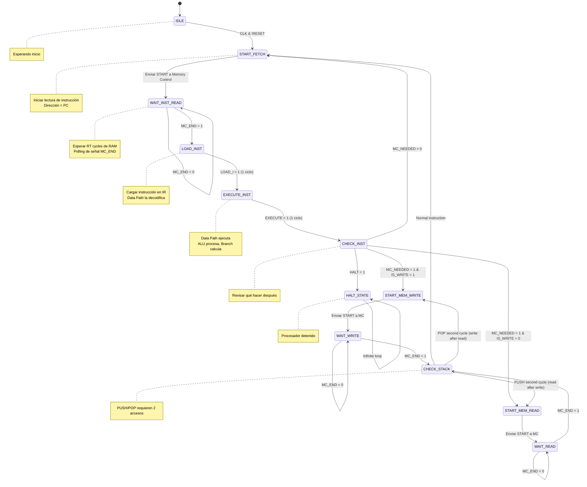

# Control Unit (Unidad de Control)

**Tipo**: Componente de Control Principal
**Estado**: 🔴 #faltante **CRÍTICO - BLOQUEANTE TOTAL**
**Ubicación**: **NO EXISTE**
**Complejidad**: ⭐⭐⭐ Tricky
**Prioridad**: 🚨🚨🚨 MÁXIMA URGENCIA

## ⚠️ ESTADO CRÍTICO

**SIN ESTE COMPONENTE, EL PROCESADOR NO FUNCIONA EN ABSOLUTO**

El Control Unit es el cerebro del procesador. Orquesta TODAS las operaciones:
- Cuándo cargar instrucciones
- Cuándo ejecutarlas
- Cuándo acceder a memoria
- Cuándo escribir resultados

**Sin Control Unit = Componentes sin coordinación = Procesador inútil**

## Descripción

La Control Unit es una máquina de estados finitos (FSM) que coordina el ciclo de ejecución de instrucciones. Es el director de orquesta que sincroniza [[Data Path]], [[Memory Control]] y todos los demás componentes.

## Responsabilidades

1. **Fetch de Instrucciones**: Iniciar lectura de instrucción desde memoria
2. **Sincronización con RAM**: Esperar RT cycles de la RAM asíncrona
3. **Carga de Instrucción**: Activar LOAD_I para cargar en [[Instruction Register]]
4. **Ejecución**: Activar EXECUTE para que [[Data Path]] procese
5. **Acceso a Memoria**: Coordinar LW/SW/PUSH/POP con [[Memory Control]]
6. **Detención**: Responder a señal HALT

## Máquina de Estados

### Estados Principales



### Tabla de Transiciones

| Estado Actual | Condición | Próximo Estado | Señales Activas |
|---------------|-----------|----------------|-----------------|
| IDLE | CLK=1, RESET=0 | START_FETCH | - |
| START_FETCH | - | WAIT_INST_READ | START_MC=1, R/W=0 |
| WAIT_INST_READ | MC_END=0 | WAIT_INST_READ | - |
| WAIT_INST_READ | MC_END=1 | LOAD_INST | - |
| LOAD_INST | - | EXECUTE_INST | LOAD_I=1 |
| EXECUTE_INST | - | CHECK_INST | EXECUTE=1 |
| CHECK_INST | HALT=1 | HALT_STATE | - |
| CHECK_INST | MC_NEEDED=1, IS_WRITE=1 | START_MEM_WRITE | - |
| CHECK_INST | MC_NEEDED=1, IS_WRITE=0 | START_MEM_READ | - |
| CHECK_INST | MC_NEEDED=0 | START_FETCH | - |
| START_MEM_WRITE | - | WAIT_WRITE | START_MC=1, R/W=1 |
| WAIT_WRITE | MC_END=0 | WAIT_WRITE | - |
| WAIT_WRITE | MC_END=1 | CHECK_STACK | - |
| START_MEM_READ | - | WAIT_READ | START_MC=1, R/W=0 |
| WAIT_READ | MC_END=0 | WAIT_READ | - |
| WAIT_READ | MC_END=1 | CHECK_STACK | - |
| CHECK_STACK | !PUSH, !POP | START_FETCH | - |
| CHECK_STACK | PUSH (1st cycle done) | START_MEM_READ | PUSH_LOAD=1 |
| CHECK_STACK | POP (1st cycle done) | START_MEM_WRITE | - |
| HALT_STATE | Always | HALT_STATE | - |

## Entradas

### Desde Sistema
| Puerto | Ancho | Descripción |
|--------|-------|-------------|
| `CLK` | 1 bit | Reloj del sistema |
| `RESET` | 1 bit | Reset sincrónico |

### Desde [[Data Path]]
| Puerto | Ancho | Descripción |
|--------|-------|-------------|
| [[HALT]] | 1 bit | Señal de instrucción HALT |
| [[MC_NEEDED]] | 1 bit | Indica que se necesita acceso a memoria |
| [[IS_WRITE]] | 1 bit | Tipo de acceso: 0=lectura, 1=escritura |
| `PUSH` | 1 bit | Señal de instrucción PUSH (para 2º ciclo) |
| `POP` | 1 bit | Señal de instrucción POP (para 2º ciclo) |

### Desde [[Memory Control]]
| Puerto | Ancho | Descripción |
|--------|-------|-------------|
| [[MC_END]] | 1 bit | Memory Control ha terminado operación |

## Salidas

### Hacia [[Data Path]]
| Puerto | Ancho | Descripción |
|--------|-------|-------------|
| [[LOAD_I]] | 1 bit | Carga instrucción en [[Instruction Register]] |
| [[EXECUTE]] | 1 bit | Habilita ejecución en [[Data Path]] |
| `PUSH_LOAD` | 1 bit | Indica 2º ciclo de PUSH (cargar después de escribir) |
| `CLR` | 1 bit | Clear/Reset general |

### Hacia [[Memory Control]]
| Puerto | Ancho | Descripción |
|--------|-------|-------------|
| [[START_MC]] | 1 bit | Inicia operación en Memory Control |
| `R/W` | 1 bit | Tipo de operación: 0=read, 1=write |

## Timing de Instrucciones

### Instrucción Normal (sin memoria)
```
Ejemplo: ADD R1, R2, R3

Ciclo 1: START_FETCH → WAIT_INST_READ
Ciclos 2-N: WAIT_INST_READ (N = RT cycles)
Ciclo N+1: LOAD_INST (LOAD_I=1)
Ciclo N+2: EXECUTE_INST (EXECUTE=1)
Ciclo N+3: CHECK_INST → START_FETCH

Total: 3 + RT cycles
```

### Instrucción con Memoria (LW)
```
Ejemplo: LW R5, 0(R10)

Ciclos 1-(RT+3): Fetch de instrucción (igual que arriba)
Ciclo RT+4: START_MEM_READ
Ciclos RT+5-(RT+4+RT): WAIT_READ
Ciclo 2*RT+5: CHECK_STACK → START_FETCH

Total: 5 + 2*RT cycles
```

### Instrucción con Memoria (SW)
```
Ejemplo: SW R5, 0(R10)

Ciclos 1-(RT+3): Fetch de instrucción
Ciclo RT+4: START_MEM_WRITE
Ciclos RT+5-(RT+4+WT): WAIT_WRITE
Ciclo RT+WT+5: CHECK_STACK → START_FETCH

Total: 5 + RT + WT cycles
```

### Stack (PUSH)
```
Ejemplo: PUSH R7

Ciclos 1-(RT+3): Fetch de instrucción
Ciclo RT+4: START_MEM_WRITE (SP ya decrementado)
Ciclos RT+5-(RT+4+WT): WAIT_WRITE
Ciclo RT+WT+5: CHECK_STACK detecta PUSH
Ciclo RT+WT+6: START_MEM_READ (para siguiente instrucción de stack)
... (si no es POP, vuelve a START_FETCH)

Total: Mínimo 6 + RT + WT cycles
```

### Stack (POP)
```
Ejemplo: POP R8

Ciclos 1-(RT+3): Fetch de instrucción
Ciclo RT+4: START_MEM_READ (de memoria[SP])
Ciclos RT+5-(RT+4+RT): WAIT_READ
Ciclo 2*RT+5: CHECK_STACK detecta POP, SP incrementado
Ciclo 2*RT+6: START_FETCH

Total: 6 + 2*RT cycles
```

## Implementación en Logisim

### Componentes Necesarios

1. **Registro de Estado**: 4-5 bits para codificar estados
   - IDLE = 0000
   - START_FETCH = 0001
   - WAIT_INST_READ = 0010
   - LOAD_INST = 0011
   - EXECUTE_INST = 0100
   - CHECK_INST = 0101
   - START_MEM_WRITE = 0110
   - WAIT_WRITE = 0111
   - START_MEM_READ = 1000
   - WAIT_READ = 1001
   - CHECK_STACK = 1010
   - HALT_STATE = 1111

2. **Lógica Combinacional de Transiciones**: Comparadores + multiplexores
   - Input: Estado actual + señales de entrada
   - Output: Próximo estado

3. **Decodificador de Salidas**: Genera señales de control según estado
   - LOAD_I = 1 cuando estado = LOAD_INST
   - EXECUTE = 1 cuando estado = EXECUTE_INST
   - START_MC = 1 cuando estado = START_FETCH | START_MEM_WRITE | START_MEM_READ
   - etc.

### Pseudocódigo
```verilog
always @(posedge CLK) begin
    if (RESET)
        state <= IDLE;
    else
        case (state)
            IDLE:
                state <= START_FETCH;

            START_FETCH:
                state <= WAIT_INST_READ;

            WAIT_INST_READ:
                if (MC_END)
                    state <= LOAD_INST;

            LOAD_INST:
                state <= EXECUTE_INST;

            EXECUTE_INST:
                state <= CHECK_INST;

            CHECK_INST:
                if (HALT)
                    state <= HALT_STATE;
                else if (MC_NEEDED && IS_WRITE)
                    state <= START_MEM_WRITE;
                else if (MC_NEEDED && !IS_WRITE)
                    state <= START_MEM_READ;
                else
                    state <= START_FETCH;

            // ... más estados
        endcase
end

// Salidas combinacionales
assign LOAD_I = (state == LOAD_INST);
assign EXECUTE = (state == EXECUTE_INST);
assign START_MC = (state == START_FETCH) ||
                  (state == START_MEM_WRITE) ||
                  (state == START_MEM_READ);
assign R/W = (state == START_MEM_WRITE) || (state == WAIT_WRITE);
```

## Coordinación con Otros Componentes

### Con [[Data Path]]
```
Control Unit envía: LOAD_I, EXECUTE
Data Path envía: HALT, MC_NEEDED, IS_WRITE
```
**Secuencia**:
1. CU: LOAD_I=1 → DP carga instrucción
2. CU: EXECUTE=1 → DP ejecuta
3. DP: MC_NEEDED=1 (si LW/SW) → CU coordina memoria

### Con [[Memory Control]]
```
Control Unit envía: START_MC, R/W
Memory Control envía: MC_END
```
**Secuencia**:
1. CU: START_MC=1 → MC inicia operación
2. CU espera polling MC_END
3. MC: MC_END=1 → CU continúa

### Ciclo Completo
```
1. CU fetch instrucción (via MC)
2. CU carga en IR (LOAD_I)
3. DP decodifica automáticamente
4. CU ejecuta (EXECUTE)
5. DP procesa, genera MC_NEEDED si necesario
6. CU coordina memoria si MC_NEEDED=1
7. Volver a 1
```

## Estimación de Trabajo

**Tiempo**: 7-10 días
**Dificultad**: Alta

**Desglose**:
1. Diseñar FSM completo (2 días)
2. Implementar registro de estado y transiciones (2 días)
3. Implementar decodificador de salidas (1 día)
4. Testing con instrucciones simples (2 días)
5. Testing con memoria (LW/SW) (1 día)
6. Testing con PUSH/POP (1 día)
7. Depuración y ajustes (1-2 días)

## Verificación

### Tests Básicos
1. Fetch y ejecución de instrucción simple (ADD)
2. Múltiples instrucciones secuenciales
3. Instrucción con memoria (LW)
4. Instrucción con escritura (SW)
5. PUSH y POP
6. HALT detiene correctamente

### Casos Críticos
- RAM lenta (RT=10, WT=15): verificar espera correcta
- PUSH seguido de POP inmediato
- HALT en mitad de operación de memoria

## Dependencias

**Requiere que existan**:
- [[Memory Control]] (para señal MC_END)
- [[Data Path]] (para señales HALT, MC_NEEDED, IS_WRITE)

**Es requerido por**:
- TODO EL PROCESADOR (sin CU, nada funciona)

## Problemas Conocidos

**Estado actual**: 🔴 NO IMPLEMENTADO

**Impacto sin este componente**:
- ❌ Imposible cargar instrucciones
- ❌ Imposible ejecutar instrucciones
- ❌ Imposible acceder a memoria
- ❌ Data Path queda "congelado"
- ❌ Procesador completamente inútil

**Conclusión**: **ESTE ES EL COMPONENTE MÁS CRÍTICO FALTANTE**

## Referencias

- Documentación: `WORKFLOW_PROYECTO.md` Fase 2.2
- Documentación: `S-MIPS_PROCESSOR_GUIDE_fixed.md` líneas 123-185
- Ver también: [[Memory Control]], [[Data Path]]
- Inspiración: `CPs/CP05.circ` → Máquinas de estados finitos

---
**Última actualización**: 2025-12-09
**Estado**: 🔴 NO IMPLEMENTADO - BLOQUEANTE TOTAL
**Prioridad**: 🚨🚨🚨 MÁXIMA - IMPLEMENTAR PRIMERO
