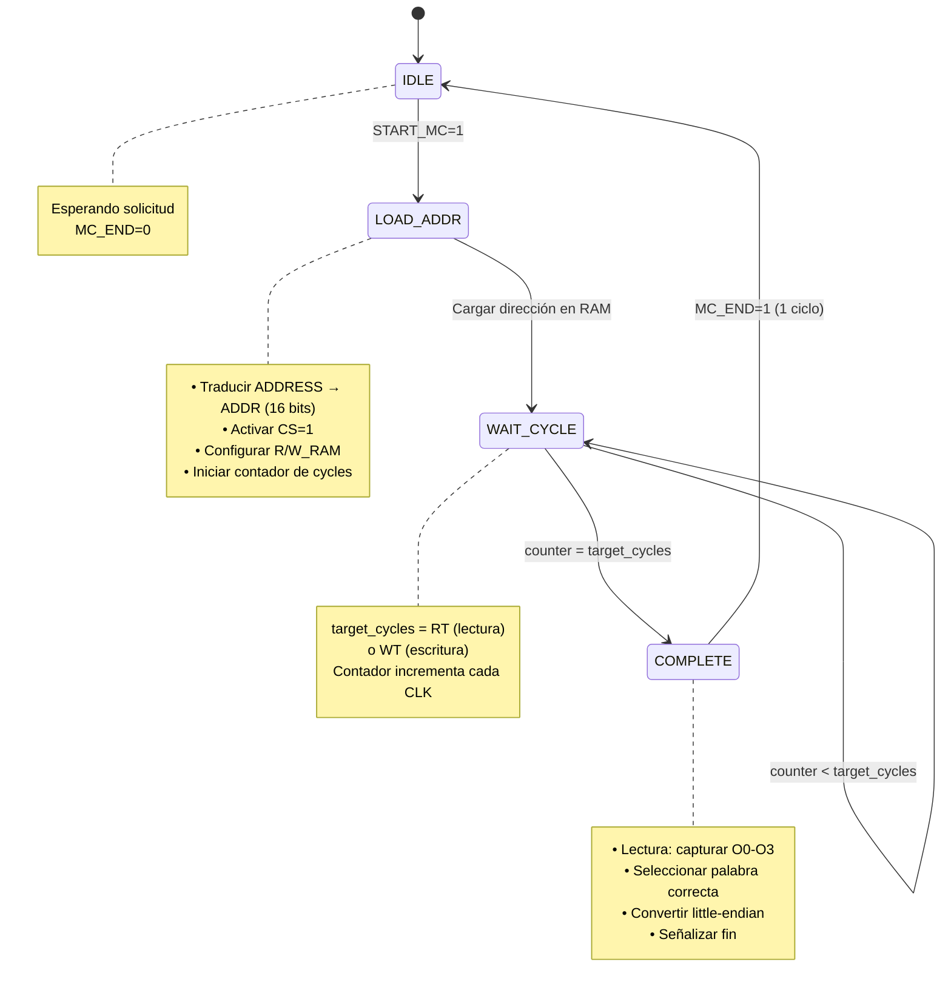

# Memory Control (Controlador de Memoria)

**Tipo**: Controlador de Interfaz
**Estado**: ✅ IMPLEMENTADO (Actualizado 2025-12-13)
**Ubicación**: Circuit "Memory Control" en s-mips.circ + 5 subcircuitos
**Complejidad**: ⭐⭐⭐ Compleja
**Prioridad**: ✅ COMPLETADO

## ✅ COMPONENTE IMPLEMENTADO

Con Memory Control implementado:
- ✅ Fetch de instrucciones FUNCIONAL
- ✅ Instrucciones LW/SW FUNCIONALES
- ✅ PUSH/POP FUNCIONALES
- ✅ [[Cache System]] puede conectarse a RAM

**Este componente funciona como puente entre CPU y memoria ✅**

## Descripción

Memory Control es el controlador que maneja toda la comunicación con la RAM asíncrona de 1 MB. Gestiona timing (RT/WT cycles), traduce direcciones, convierte endianness y selecciona palabras dentro de bloques.

## Arquitectura General

```
┌────────────────────────────────────────────────────────┐
│              MEMORY CONTROL                            │
│                                                        │
│  ┌──────────────────────────────────────────────┐    │
│  │      State Machine (RT/WT Cycles)            │    │
│  │  • IDLE → LOAD_ADDR → WAIT → COMPLETE        │    │
│  └──────────────────────────────────────────────┘    │
│                        ↓                               │
│  ┌──────────────────────────────────────────────┐    │
│  │      Address Translator                      │    │
│  │  • Byte address → Block address (÷16)        │    │
│  │  • Word offset within block                  │    │
│  └──────────────────────────────────────────────┘    │
│                        ↓                               │
│  ┌──────────────────────────────────────────────┐    │
│  │      Little-Endian Converter                 │    │
│  │  • Bit reversal: swap bit[0]↔bit[31], etc   │    │
│  └──────────────────────────────────────────────┘    │
│                        ↓                               │
│  ┌──────────────────────────────────────────────┐    │
│  │      Word Selector / MASK Generator          │    │
│  │  • Select 1 of 4 words in block              │    │
│  │  • Generate MASK for writes                  │    │
│  └──────────────────────────────────────────────┘    │
└────────────────────────────────────────────────────────┘
           ↓                              ↑
        To RAM                       From RAM
    (ADDR, CS, R/W,              (O0-O3, RT, WT)
     I0-I3, MASK)
```

## Subcomponentes Necesarios

### 1. [[Memory State Machine]]
### 2. [[Address Translator]]
### 3. [[Little-Endian Converter]]
### 4. [[Word Selector]]
### 5. [[MASK Generator]]

## Entradas

### Desde [[Control Unit]]
| Puerto | Ancho | Descripción |
|--------|-------|-------------|
| [[START_MC]] | 1 bit | Inicia operación de memoria |
| `R/W` | 1 bit | 0=Read, 1=Write |
| `CLK` | 1 bit | Reloj del sistema |
| `RESET` | 1 bit | Reset sincrónico |

### Desde [[Data Path]] o [[Cache System]]

**Opción A (Recomendada): Dos pines separados**

| Puerto | Ancho | Fuente | Descripción |
|--------|-------|---------|-------------|
| `PC` | 32 bits | [[Program Counter]] | Dirección para fetch de instrucciones |
| `MEM_ADDRESS` | 32 bits | ALU Result | Dirección efectiva para LW/SW/PUSH/POP (base + offset) |
| `DATA_WRITE` | 32 bits | [[Register File]] READ_DATA_2 | Dato a escribir (para SW/PUSH) |

**MUX interno en Memory Control**: Selecciona entre PC (si fetch) o MEM_ADDRESS (si LW/SW)
```verilog
wire [31:0] final_address;
assign final_address = is_fetch ? PC : MEM_ADDRESS;
```

**Opción B (Alternativa): Un solo ADDRESS con control**

| Puerto | Ancho | Fuente | Descripción |
|--------|-------|---------|-------------|
| `ADDRESS` | 32 bits | [[Data Path]] | PC (si fetch) o ALU Result (si LW/SW) - multiplexado en Data Path |
| `DATA_WRITE` | 32 bits | [[Register File]] READ_DATA_2 | Dato a escribir |

Donde Data Path usa un MUX para seleccionar:
```verilog
assign ADDRESS = (state == FETCH) ? PC : ALU_RESULT;
```

**Recomendación**: Usar **Opción A** (dos pines) para mayor claridad y separación de concerns.

### Desde [[RAM Module]]
| Puerto | Ancho | Descripción |
|--------|-------|-------------|
| `O0` | 32 bits | Palabra 0 del bloque leído |
| `O1` | 32 bits | Palabra 1 del bloque leído |
| `O2` | 32 bits | Palabra 2 del bloque leído |
| `O3` | 32 bits | Palabra 3 del bloque leído |
| `RT` | 4 bits | Read Time (ciclos para lectura) |
| `WT` | 4 bits | Write Time (ciclos para escritura) |

## Salidas

### Hacia [[Control Unit]]
| Puerto | Ancho | Descripción |
|--------|-------|-------------|
| [[MC_END]] | 1 bit | Operación de memoria completada |

### Hacia [[Data Path]] o [[Cache System]]
| Puerto | Ancho | Descripción |
|--------|-------|-------------|
| `DATA_READ` | 32 bits | Dato leído de memoria (para LW/POP) |
| `BLOCK_OUT` | 128 bits | Bloque completo (4 palabras) para caché |

### Hacia [[RAM Module]]
| Puerto | Ancho | Descripción |
|--------|-------|-------------|
| `ADDR` | 16 bits | Dirección de bloque (0-65535) |
| `CS` | 1 bit | Chip Select (siempre 1 para RAM activa) |
| `R/W_RAM` | 1 bit | 0=Read, 1=Write |
| `I0` | 32 bits | Dato a escribir en palabra 0 |
| `I1` | 32 bits | Dato a escribir en palabra 1 |
| `I2` | 32 bits | Dato a escribir en palabra 2 |
| `I3` | 32 bits | Dato a escribir en palabra 3 |
| `MASK` | 4 bits | Máscara de escritura: bit[i]=1 escribe palabra i |

## Máquina de Estados

### Estados



### Tabla de Transiciones

| Estado | Condición | Próximo Estado | Acciones |
|--------|-----------|----------------|----------|
| IDLE | START_MC=0 | IDLE | MC_END=0 |
| IDLE | START_MC=1 | LOAD_ADDR | Iniciar operación |
| LOAD_ADDR | - | WAIT_CYCLE | CS=1, cargar ADDR, counter=0 |
| WAIT_CYCLE | counter < cycles | WAIT_CYCLE | counter++ |
| WAIT_CYCLE | counter = cycles | COMPLETE | Capturar datos si lectura |
| COMPLETE | - | IDLE | MC_END=1, output DATA_READ |

## Address Translation (Traducción de Direcciones)

### Formato de Dirección de 32 bits

```
┌─────────────────┬─────────┬────────┬──────┐
│   Block Addr    │ Word    │ Byte   │      │
│    16 bits      │ 2 bits  │ 2 bits │      │
│   bits [19:4]   │ [3:2]   │ [1:0]  │      │
└─────────────────┴─────────┴────────┴──────┘
31              20 19      4 3      2 1    0
```

**Componentes**:
- **Block Address (bits 19-4)**: Selecciona 1 de 65,536 bloques
- **Word Offset (bits 3-2)**: Selecciona 1 de 4 palabras en el bloque
  - 00 → Palabra 0
  - 01 → Palabra 1
  - 10 → Palabra 2
  - 11 → Palabra 3
- **Byte Offset (bits 1-0)**: DEBE ser 00 (alineación a 4 bytes)
- **Bits superiores (31-20)**: Ignorados (solo 1 MB = 2^20 bytes)

### Ejemplo de Traducción

```
Dirección byte: 0x000012A4 = 0000 0000 0000 0000 0001 0010 1010 0100

Desglose:
  Bits [31:20]: 0000 0000 0000 → ignorados
  Bits [19:4]:  0000 0000 0001 0010 1010 → Block 0x012A (298 decimal)
  Bits [3:2]:   01 → Word 1
  Bits [1:0]:   00 → Alineado ✓

Resultado:
  ADDR (a RAM) = 0x012A (16 bits)
  Word offset = 1 → Seleccionar O1
```

### Código de Traducción
```verilog
assign block_addr = ADDRESS[19:4];  // 16 bits para ADDR de RAM
assign word_offset = ADDRESS[3:2];  // 2 bits para seleccionar palabra
assign is_aligned = (ADDRESS[1:0] == 2'b00);  // Verificar alineación
```

## Little-Endian Conversion (Conversión de Endianness)

### Problema
- **CPU S-MIPS**: Little-endian (byte menos significativo en dirección más baja)
- **RAM interna**: Big-endian (byte más significativo primero)
- **Solución**: Bit reversal (intercambiar bits)

### Operación de Bit Reversal

```
Big-Endian (RAM):    [31 30 29 ... 2 1 0]
                           ↓ swap ↓
Little-Endian (CPU): [0  1  2 ... 29 30 31]
```

**Ejemplo**:
```
RAM output:  0xAABBCCDD
  Binario:   10101010 10111011 11001100 11011101

Después de bit reversal:
  Binario:   10111011 00110011 11011101 01010101
  Hex:       0xBB33DD55

CPU recibe: 0xBB33DD55
```

### Implementación en Logisim

**Opción 1: Splitter + Combinational Logic**
```
1. Split 32 bits en 32 bits individuales
2. Recombinar en orden inverso:
   bit_out[0] = bit_in[31]
   bit_out[1] = bit_in[30]
   ...
   bit_out[31] = bit_in[0]
```

**Opción 2: Byte Swapping (más simple)**
```
Input:  [Byte3][Byte2][Byte1][Byte0]
Output: [Byte0][Byte1][Byte2][Byte3]
```
Usa splitter de 4 bytes, reconecta en orden inverso.

### Cuándo Aplicar
- **Lectura (RAM → CPU)**: Aplicar bit reversal a dato leído
- **Escritura (CPU → RAM)**: Aplicar bit reversal a dato a escribir
- **Address**: NO aplicar (direcciones son numéricas, no byte arrays)

## Word Selector (Selección de Palabra)

### Función
RAM devuelve 4 palabras (O0-O3) simultáneamente. Debemos seleccionar la correcta según word_offset.

### Implementación
```verilog
always @(*) begin
    case (word_offset)
        2'b00: selected_word = O0;
        2'b01: selected_word = O1;
        2'b10: selected_word = O2;
        2'b11: selected_word = O3;
    endcase
end

// Aplicar little-endian conversion
assign DATA_READ = bit_reverse(selected_word);
```

### En Logisim
Usar **Multiplexor de 4 entradas** (32 bits cada una):
- Entradas: O0, O1, O2, O3
- Selector: word_offset (2 bits)
- Salida → [[Little-Endian Converter]] → DATA_READ

## MASK Generator (Generador de Máscara)

### Función
Para escrituras, indicar a la RAM cuál de las 4 palabras escribir. Solo se debe escribir la palabra especificada por word_offset.

### Generación de MASK
```verilog
always @(*) begin
    case (word_offset)
        2'b00: MASK = 4'b0001;  // Escribir solo palabra 0
        2'b01: MASK = 4'b0010;  // Escribir solo palabra 1
        2'b10: MASK = 4'b0100;  // Escribir solo palabra 2
        2'b11: MASK = 4'b1000;  // Escribir solo palabra 3
    endcase
end
```

### Distribución de Datos de Escritura
```verilog
// Convertir dato a big-endian
wire [31:0] data_be = bit_reverse(DATA_WRITE);

// Colocar en todas las entradas (RAM solo escribe según MASK)
assign I0 = data_be;
assign I1 = data_be;
assign I2 = data_be;
assign I3 = data_be;
```

**Nota**: RAM ignora I0-I3 donde MASK[i]=0, así que es seguro enviar el mismo dato a todas.

## Timing y Sincronización

### Lectura Completa
```
Ciclo 1:   START_MC=1 → Estado: LOAD_ADDR
Ciclo 2:   Estado: WAIT_CYCLE, counter=0
Ciclo 3:   Estado: WAIT_CYCLE, counter=1
...
Ciclo N+1: Estado: WAIT_CYCLE, counter=RT-1
Ciclo N+2: Estado: COMPLETE, capturar O0-O3
Ciclo N+3: MC_END=1, DATA_READ válido
Ciclo N+4: Estado: IDLE, esperando próxima operación
```

### Escritura Completa
```
Ciclo 1:   START_MC=1, R/W=1 → Estado: LOAD_ADDR
           I0-I3 ya tienen datos, MASK generado
Ciclo 2:   Estado: WAIT_CYCLE, counter=0
Ciclo 3:   Estado: WAIT_CYCLE, counter=1
...
Ciclo M+1: Estado: WAIT_CYCLE, counter=WT-1
Ciclo M+2: Estado: COMPLETE
Ciclo M+3: MC_END=1
Ciclo M+4: Estado: IDLE
```

## Integración con Cache (Sistema de Bypass)

Memory Control debe ser **agnóstico** a si hay cachés o no. Las cachés se comportan como capas opcionales.

### Operación sin Caché (modo bypass)
```
CPU/Control Unit → Memory Control → RAM
```
Memory Control accede directamente a RAM. Sistema funciona normalmente.

### Operación con Caché
```
CPU → I-Cache/D-Cache → Memory Control → RAM
                ↓ (on hit)
              CPU
```

**Cache miss**:
1. Cache solicita bloque completo a Memory Control
2. Memory Control lee 4 palabras (O0-O3)
3. Memory Control devuelve `BLOCK_OUT` = {O0, O1, O2, O3} (128 bits)
4. Cache almacena bloque completo
5. Cache devuelve palabra solicitada a CPU

**Cache hit**:
- Cache devuelve dato directamente en 1 ciclo
- Memory Control no se usa

### Multiplexado de Requests (Instrucción vs Datos)

Cuando hay cachés, Memory Control debe arbitrar entre requests de [[Instruction Cache]] y [[Data Cache]]:

**Interfaz actualizada (con cachés)**:

#### Entradas (multiplexadas)
| Puerto | Ancho | Fuente | Descripción |
|--------|-------|---------|-------------|
| `MC_START_I` | 1 bit | Instruction Cache | Request de I-Cache (on miss) |
| `MC_START_D` | 1 bit | Data Cache | Request de D-Cache (on miss) |
| `MC_ADDRESS_I` | 32 bits | I-Cache | Dirección de bloque (instrucciones) |
| `MC_ADDRESS_D` | 32 bits | D-Cache | Dirección de bloque (datos) |
| `MC_RW_D` | 1 bit | D-Cache | Read/Write (0=read, 1=write) |
| `MC_DATA_WRITE_D` | 32 bits | D-Cache | Dato a escribir (write-through) |

#### Salidas (compartidas)
| Puerto | Ancho | Destino | Descripción |
|--------|-------|---------|-------------|
| `MC_BLOCK_DATA` | 128 bits | Ambas cachés | Bloque de 4 palabras leído de RAM |
| `MC_END_I` | 1 bit | Instruction Cache | Operación I-Cache completada |
| `MC_END_D` | 1 bit | Data Cache | Operación D-Cache completada |

#### Lógica de Arbitraje (Prioridad Fija)
```verilog
// Prioridad: Data Cache > Instruction Cache
// (datos son más críticos que instrucciones)

if (MC_START_D) begin
    // Servir Data Cache
    MC_ADDRESS = MC_ADDRESS_D;
    MC_RW = MC_RW_D;
    MC_DATA_WRITE = MC_DATA_WRITE_D;
    // Cuando termine: MC_END_D = 1
end
else if (MC_START_I) begin
    // Servir Instruction Cache
    MC_ADDRESS = MC_ADDRESS_I;
    MC_RW = 0;  // Siempre lectura para instrucciones
    // Cuando termine: MC_END_I = 1
end
else begin
    // Direct from Control Unit (modo sin cachés)
    MC_ADDRESS = ADDRESS;  // o PC/MEM_ADDRESS según Opción A/B
    MC_RW = R/W;
    // Cuando termine: MC_END = 1
end
```

**Nota**: Memory Control es **agnóstico** a si hay cachés. Solo responde a requests de START y genera señales END. La capa de cachés es opcional y transparente.

Ver: [[Cache System Overview]], [[GUIA-CONEXION-CACHES]], y [[Correcciones de Conectividad - S-MIPS Processor]] para integración completa.

## Estimación de Trabajo

**Tiempo**: 5-6 días
**Dificultad**: Alta

**Desglose**:
1. Implementar State Machine (2 días)
2. Implementar Address Translator (1 día)
3. Implementar Little-Endian Converter (1 día)
4. Implementar Word Selector y MASK (1 día)
5. Testing con RAM (1-2 días)

## Verificación

### Tests Básicos
1. **Lectura alineada**:
   - LW R1, 0(R0) donde memoria[0] = 0x12345678
   - Verificar R1 = 0x12345678 (después de conversión)

2. **Escritura alineada**:
   - SW R1, 4(R0) donde R1 = 0xAABBCCDD
   - Verificar memoria[4] = 0xAABBCCDD (formato RAM interno)

3. **Word offset**:
   - Leer direcciones 0, 4, 8, 12 (mismo bloque)
   - Verificar que se seleccionan O0, O1, O2, O3 correctamente

4. **RT/WT variable**:
   - Configurar RAM con RT=5, WT=10
   - Verificar que Memory Control espera los ciclos correctos

5. **Little-endian**:
   - Escribir 0x01020304
   - Leer byte por byte: debe ser 04, 03, 02, 01 (little-endian)

### Tests Avanzados
- LW/SW en direcciones altas (0xFFFFF)
- Múltiples accesos consecutivos
- Intercalar lecturas y escrituras

## Dependencias

**Requiere**:
- [[RAM Module]] (ya existe)
- [[Control Unit]] (para señal START_MC)
- [[Data Path]] (para ADDRESS y DATA_WRITE)

**Es requerido por**:
- [[Control Unit]] (para señal MC_END)
- [[Cache System]] (para lectura de bloques)
- Instrucciones LW, SW, PUSH, POP, fetch de instrucciones

## Problemas Conocidos

**Estado actual**: 🔴 NO IMPLEMENTADO

**Impacto sin este componente**:
- ❌ Imposible ejecutar programas (no hay fetch)
- ❌ LW/SW no funcionales
- ❌ PUSH/POP no funcionales
- ❌ Caché no puede conectarse

**Prioridad**: 🚨🚨 SEGUNDA MÁS ALTA (después de Control Unit)

## Referencias

- Documentación: `WORKFLOW_PROYECTO.md` Fase 4.1
- Documentación: `S-MIPS_PROCESSOR_GUIDE_fixed.md` líneas 187-328
- Especificación RAM: `s-mips.pdf` páginas 12-13
- Ver también: [[Control Unit]], [[Cache System]], [[RAM Module]]

---
**Última actualización**: 2025-12-09
**Estado**: 🔴 NO IMPLEMENTADO - BLOQUEANTE
**Prioridad**: 🚨🚨 URGENTE (después de Control Unit)
