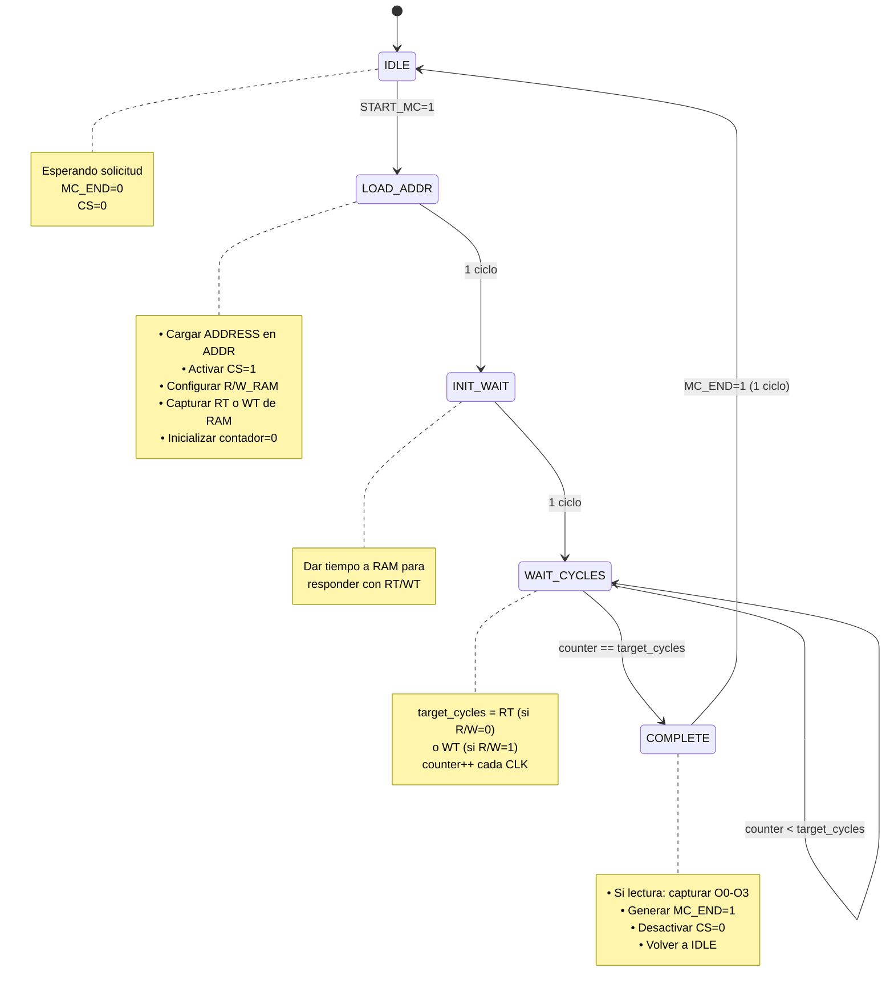

# Memory State Machine (Máquina de Estados de Memoria)

**Tipo**: FSM (Finite State Machine)
**Estado**: #implementado 
**Ubicación**: **NO EXISTE** (debe estar dentro de [[Memory Control]])
**Complejidad**: ⭐⭐ Moderada
**Prioridad**: 🚨🚨 URGENTE

## Descripción

La Memory State Machine es el núcleo del [[Memory Control]], responsable de gestionar el timing de operaciones de lectura/escritura con la RAM asíncrona. Controla los ciclos de espera (RT para lectura, WT para escritura) y señaliza cuando la operación ha completado.

## Responsabilidades

1. **Gestionar timing RT/WT** - Contar ciclos de espera correctos
2. **Activar CS (Chip Select)** - Habilitar RAM cuando necesario
3. **Configurar R/W** - Indicar operación de lectura o escritura
4. **Señalizar completado (MC_END)** - Avisar al [[Control Unit]]
5. **Mantener direcciones estables** durante operación

## Estados de la FSM



## Tabla de Transiciones

| Estado Actual | Condición         | Próximo Estado | Acciones                         |
| ------------- | ----------------- | -------------- | -------------------------------- |
| IDLE          | START_MC=0        | IDLE           | MC_END=0, CS=0                   |
| IDLE          | START_MC=1        | LOAD_ADDR      | Capturar ADDRESS, R/W            |
| LOAD_ADDR     | Always            | INIT_WAIT      | CS=1, R/W_RAM ← R/W, cargar addr |
| INIT_WAIT     | Always            | WAIT_CYCLES    | Leer RT o WT, counter=0          |
| WAIT_CYCLES   | counter < target  | WAIT_CYCLES    | counter++                        |
| WAIT_CYCLES   | counter == target | COMPLETE       | -                                |
| COMPLETE      | Always            | IDLE           | MC_END=1, CS=0                   |

## Señales de Estado

### Estados (codificación sugerida)

| Estado | Código | Bits |
|--------|--------|------|
| IDLE | 000 | 3 bits |
| LOAD_ADDR | 001 | |
| INIT_WAIT | 010 | |
| WAIT_CYCLES | 011 | |
| COMPLETE | 100 | |

### Registros Internos

| Registro | Ancho | Descripción |
|----------|-------|-------------|
| `current_state` | 3 bits | Estado actual de FSM |
| `counter` | 4 bits | Contador de ciclos (0-15) |
| `target_cycles` | 4 bits | RT o WT objetivo |
| `operation_type` | 1 bit | 0=Read, 1=Write |

## Entradas

| Puerto | Ancho | Descripción |
|--------|-------|-------------|
| `START_MC` | 1 bit | Inicia operación (desde [[Control Unit]]) |
| `R/W` | 1 bit | Tipo de operación: 0=Read, 1=Write |
| `RT` | 4 bits | Read Time de RAM (ciclos) |
| `WT` | 4 bits | Write Time de RAM (ciclos) |
| `CLK` | 1 bit | Reloj del sistema |
| `RESET` | 1 bit | Reset sincrónico |

## Salidas

| Puerto | Ancho | Descripción |
|--------|-------|-------------|
| `MC_END` | 1 bit | Operación completada (a [[Control Unit]]) |
| `CS` | 1 bit | Chip Select para RAM |
| `R/W_RAM` | 1 bit | Control R/W para RAM |

**⚠️ IMPORTANTE: CAPTURE_DATA FUE ELIMINADO**

La señal `CAPTURE_DATA` fue eliminada de la especificación porque es innecesaria.

### Justificación

En Logisim, los registros capturan datos automáticamente en el flanco de reloj cuando están habilitados. La captura de datos de O0-O3 ocurre implícitamente en el estado COMPLETE sin necesidad de una señal especial de captura.

El dato simplemente se lee de las salidas O0-O3 de la RAM y se procesa a través del [[Word Selector]] y [[Little-Endian Converter]] cuando `MC_END=1`.

## Pseudocódigo Verilog

```verilog
module memory_state_machine (
    input wire CLK,
    input wire RESET,
    input wire START_MC,
    input wire R_W,              // 0=Read, 1=Write
    input wire [3:0] RT,         // Read time from RAM
    input wire [3:0] WT,         // Write time from RAM
    output reg MC_END,
    output reg CS,
    output reg R_W_RAM
    // NOTA: CAPTURE_DATA fue eliminado - es innecesario en Logisim
);

// Estados
localparam IDLE        = 3'b000;
localparam LOAD_ADDR   = 3'b001;
localparam INIT_WAIT   = 3'b010;
localparam WAIT_CYCLES = 3'b011;
localparam COMPLETE    = 3'b100;

// Registros
reg [2:0] current_state, next_state;
reg [3:0] counter;
reg [3:0] target_cycles;
reg operation_type;  // 0=Read, 1=Write

// Lógica de estados
always @(posedge CLK) begin
    if (RESET) begin
        current_state <= IDLE;
        counter <= 4'b0000;
        target_cycles <= 4'b0000;
        operation_type <= 1'b0;
    end
    else begin
        current_state <= next_state;

        case (current_state)
            LOAD_ADDR: begin
                operation_type <= R_W;
                counter <= 4'b0000;
            end

            INIT_WAIT: begin
                // Capturar RT o WT según operación
                target_cycles <= (operation_type == 1'b0) ? RT : WT;
            end

            WAIT_CYCLES: begin
                counter <= counter + 1;
            end
        endcase
    end
end

// Lógica de transiciones
always @(*) begin
    case (current_state)
        IDLE: begin
            if (START_MC == 1'b1)
                next_state = LOAD_ADDR;
            else
                next_state = IDLE;
        end

        LOAD_ADDR: begin
            next_state = INIT_WAIT;
        end

        INIT_WAIT: begin
            next_state = WAIT_CYCLES;
        end

        WAIT_CYCLES: begin
            if (counter >= target_cycles)
                next_state = COMPLETE;
            else
                next_state = WAIT_CYCLES;
        end

        COMPLETE: begin
            next_state = IDLE;
        end

        default: begin
            next_state = IDLE;
        end
    endcase
end

// Lógica de salidas
always @(*) begin
    // Valores por defecto
    MC_END = 1'b0;
    CS = 1'b0;
    R_W_RAM = 1'b0;

    case (current_state)
        IDLE: begin
            MC_END = 1'b0;
            CS = 1'b0;
        end

        LOAD_ADDR: begin
            CS = 1'b1;
            R_W_RAM = operation_type;
        end

        INIT_WAIT: begin
            CS = 1'b1;
            R_W_RAM = operation_type;
        end

        WAIT_CYCLES: begin
            CS = 1'b1;
            R_W_RAM = operation_type;
        end

        COMPLETE: begin
            MC_END = 1'b1;
            CS = 1'b0;
            // Nota: CAPTURE_DATA eliminado
            // Los datos de O0-O3 se leen directamente cuando MC_END=1
        end
    endcase
end

endmodule
```

## Timing Diagrams

### Operación de Lectura (RT=3 cycles)

```
CLK:        ___───___───___───___───___───___───___───___
            0   1   2   3   4   5   6   7   8

State:      [IDLE][LOAD][INIT][WAIT][WAIT][WAIT][COMP][IDLE]

START_MC:   ________───_______________________________________

R/W:        ________0_________________________________________

CS:         ________________───────────────────________

R/W_RAM:    ________________0──────────────────________

Counter:    [0][0][0][0][1][2][3][3][0]
                        └─ Incrementa cada ciclo

MC_END:     ____________________________________________───___
                                                        ↑ Datos O0-O3 disponibles
```

### Operación de Escritura (WT=2 cycles)

```
CLK:        ___───___───___───___───___───___───___
            0   1   2   3   4   5   6   7

State:      [IDLE][LOAD][INIT][WAIT][WAIT][COMP][IDLE]

START_MC:   ________───_______________________________

R/W:        ________1_________________________________

CS:         ________________───────────────________

R/W_RAM:    ________________1──────────────________

Counter:    [0][0][0][0][1][2][2][0]
                        └─ Incrementa

MC_END:     ____________________________________───___

I0-I3:      ________________[DATA]─────────────
                            └─ Mantener estable durante WT
```

## Casos Especiales

### 1. RT o WT = 0 (Instantáneo)

Si RAM responde con RT=0 o WT=0 (memoria instantánea):

```
CLK:        ___───___───___───___
            0   1   2   3   4

State:      [IDLE][LOAD][INIT][WAIT][COMP]
                              └─ counter(0) == target(0) → COMPLETE

Counter:    [0][0][0][0][0]

MC_END:     ________________________───
```

**Total**: 4 ciclos mínimo (LOAD + INIT + WAIT + COMPLETE)

### 2. RT o WT muy grande (15 cycles)

```
State:      [IDLE][LOAD][INIT][WAIT][WAIT]...[WAIT][COMP]
                              └──── 15 ciclos ────┘

Counter:    0 → 1 → 2 → ... → 14 → 15

Total: 4 + 15 = 19 ciclos
```

**Límite**: Counter de 4 bits soporta hasta 15 cycles.

### 3. START_MC pulsado durante operación

```
State:      [WAIT][WAIT][WAIT]...
            ↓
START_MC:   ───────────────────  (ignorado)
```

**Comportamiento**: START_MC se ignora si no en IDLE.

**Prevención**: [[Control Unit]] debe garantizar START_MC solo cuando MC_END activo.

## Implementación en Logisim

### Subcircuito "Memory FSM"

```
Componentes:
├─ State Register (3 bits)
│  └─ Almacena current_state
│
├─ Counter Register (4 bits)
│  └─ Cuenta ciclos de espera
│
├─ Target Register (4 bits)
│  └─ Almacena RT o WT
│
├─ Operation Type Register (1 bit)
│  └─ Almacena R/W
│
├─ Comparator
│  ├─ Input A: counter
│  ├─ Input B: target_cycles
│  └─ Output: counter_done (counter >= target)
│
├─ Next State Logic (ROM o combinacional)
│  ├─ Inputs: current_state, START_MC, counter_done
│  └─ Output: next_state
│
└─ Output Logic (ROM o combinacional)
   ├─ Input: current_state
   └─ Outputs: MC_END, CS, R_W_RAM, CAPTURE_DATA
```

### Conexiones con [[Memory Control]]

```
Memory Control
├─ Control Unit Interface
│  ├─ IN: START_MC
│  ├─ IN: R/W
│  └─ OUT: MC_END
│
├─ Memory FSM ⭐ (este componente)
│  ├─ Coordina timing
│  └─ Genera CS, R_W_RAM
│
├─ Address Translator
│  └─ Traduce direcciones
│
├─ Data Path
│  ├─ Little-Endian Converter
│  ├─ Word Selector
│  └─ MASK Generator
│
└─ RAM Interface
   ├─ OUT: CS, R_W_RAM
   ├─ OUT: ADDR, I0-I3, MASK
   └─ IN: O0-O3, RT, WT
```

## Tests de Validación

### Test 1: Lectura Básica

```
Stimulus:
├─ START_MC = 1 (1 ciclo)
├─ R/W = 0 (Read)
└─ RT = 3 (de RAM)

Expected:
├─ CS activa durante 3 cycles en WAIT
├─ MC_END=1 en ciclo COMPLETE
├─ CAPTURE_DATA=1 cuando MC_END=1
└─ Total: ~7 ciclos
```

### Test 2: Escritura Básica

```
Stimulus:
├─ START_MC = 1
├─ R/W = 1 (Write)
└─ WT = 2

Expected:
├─ CS activa durante 2 cycles
├─ R_W_RAM = 1 durante operación
├─ MC_END=1 en COMPLETE
└─ Total: ~6 ciclos
```

### Test 3: Operación Rápida (RT=0)

```
Stimulus:
├─ START_MC = 1
├─ R/W = 0
└─ RT = 0

Expected:
├─ Mínimo 4 ciclos (LOAD+INIT+WAIT+COMPLETE)
├─ WAIT state solo 1 ciclo (0 >= 0)
└─ MC_END activa correctamente
```

### Test 4: Múltiples Operaciones Consecutivas

```
Stimulus:
├─ Op 1: START_MC, R/W=0, RT=2
├─ Wait for MC_END
├─ Op 2: START_MC, R/W=1, WT=3
├─ Wait for MC_END

Expected:
├─ Ambas operaciones completan correctamente
├─ No overlap entre operaciones
└─ FSM vuelve a IDLE entre operaciones
```

## Troubleshooting

### Problema: MC_END nunca se activa

**Causas**:
1. Counter no incrementa
2. target_cycles nunca alcanzado
3. FSM atascada en WAIT_CYCLES

**Solución**: Verificar lógica de counter y comparador

### Problema: Operación muy rápida/lenta

**Causas**:
1. RT/WT no capturados correctamente
2. Counter incrementa incorrectamente

**Solución**: Verificar timing de captura de RT/WT en INIT_WAIT

### Problema: CS siempre activo

**Causa**: FSM no vuelve a IDLE
**Solución**: Verificar transición COMPLETE → IDLE

## Enlaces Relacionados

- [[Memory Control]] - Componente padre
- [[Control Unit]] - Envía START_MC, recibe MC_END
- [[Address Translator]] - Traduce direcciones
- [[Little-Endian Converter]] - Procesa datos

---

**Prioridad**: 🚨🚨 URGENTE (parte crítica de Memory Control)
**Tiempo estimado**: 2-3 días (dentro de los 5-6 días de Memory Control)
**Bloquea**: Todo acceso a memoria
