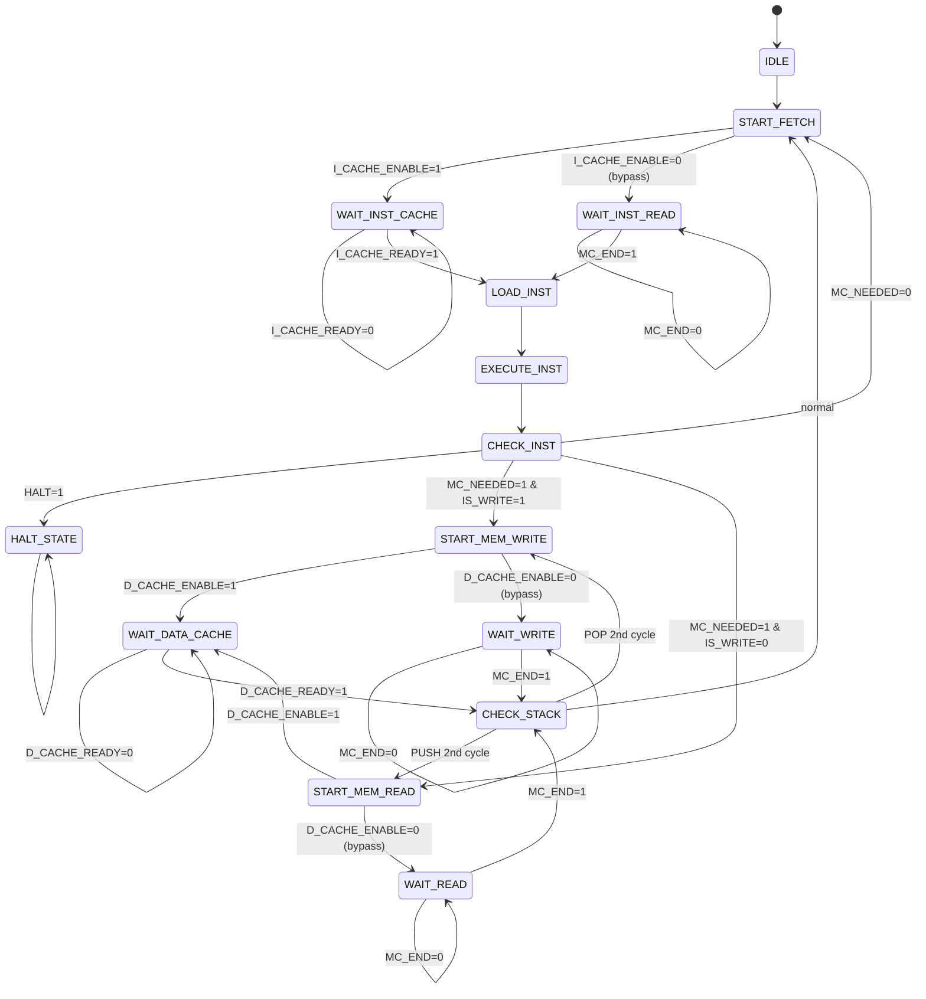

# Cambios en FSM de Control Unit para Integración de Cachés

**Fecha**: 2025-12-14
**Propósito**: Modificaciones necesarias en la máquina de estados del Control Unit para soportar cachés con sistema de bypass

---

## 🎯 RESUMEN EJECUTIVO

Para integrar las cachés con el Control Unit, se necesitan:
1. **2 parámetros de configuración** (I_CACHE_ENABLE, D_CACHE_ENABLE)
2. **4 nuevas señales de entrada** (I_CACHE_READY, D_CACHE_READY, + opcionales)
3. **3 nuevas señales de salida** (I_CACHE_REQ, D_CACHE_READ_REQ, D_CACHE_WRITE_REQ)
4. **2 nuevos estados** (WAIT_INST_CACHE, WAIT_DATA_CACHE)
5. **Modificaciones a 3 estados existentes** (START_FETCH, START_MEM_READ, START_MEM_WRITE)

---

## 📊 PARÁMETROS DE CONFIGURACIÓN

### Agregar a Control Unit

```verilog
// Parámetros de configuración de cachés (pueden ser pines o constantes)
parameter I_CACHE_ENABLE = 1'b0;  // 0 = bypass, 1 = usar I-Cache
parameter D_CACHE_ENABLE = 1'b0;  // 0 = bypass, 1 = usar D-Cache
```

**Implementación en Logisim**:
- **Opción 1 (Flexible)**: Pines de entrada del CPU que se pueden configurar
- **Opción 2 (Fija)**: Constantes en el Control Unit
- **Recomendación**: Opción 1 para poder habilitar/deshabilitar cachés dinámicamente

---

## 🔌 NUEVAS SEÑALES DE ENTRADA

### Desde Instruction Cache

| Puerto | Ancho | Descripción |
|--------|-------|-------------|
| `I_CACHE_READY` | 1 bit | I-Cache tiene instrucción lista (hit o miss resuelto) |

### Desde Data Cache

| Puerto | Ancho | Descripción |
|--------|-------|-------------|
| `D_CACHE_READY` | 1 bit | D-Cache tiene dato listo (hit o miss resuelto) |

**Total: 2 señales obligatorias**

### Opcionales (para debugging/stats):

| Puerto | Ancho | Descripción |
|--------|-------|-------------|
| `I_CACHE_HIT` | 1 bit | I-Cache hit (1) o miss (0) |
| `D_CACHE_HIT` | 1 bit | D-Cache hit (1) o miss (0) |

---

## 🔌 NUEVAS SEÑALES DE SALIDA

### Hacia Instruction Cache

| Puerto | Ancho | Descripción |
|--------|-------|-------------|
| `I_CACHE_REQ` | 1 bit | Solicitud de fetch a I-Cache |

### Hacia Data Cache

| Puerto | Ancho | Descripción |
|--------|-------|-------------|
| `D_CACHE_READ_REQ` | 1 bit | Solicitud de lectura (LW/POP) |
| `D_CACHE_WRITE_REQ` | 1 bit | Solicitud de escritura (SW/PUSH) |

**Total: 3 señales obligatorias**

---

## 🔄 NUEVOS ESTADOS DE LA FSM

### Estado: WAIT_INST_CACHE

**Propósito**: Esperar respuesta de Instruction Cache

```verilog
WAIT_INST_CACHE:
    if (I_CACHE_READY == 1'b1) begin
        // Cache respondió (hit en 1 ciclo, o miss resuelto después de RT cycles)
        next_state = LOAD_INST;
    end
    else begin
        // Seguir esperando
        next_state = WAIT_INST_CACHE;
    end
```

**Señales activas**:
- `I_CACHE_REQ = 1` (mantener request activo)

**Timing**:
- **Cache hit**: 1 ciclo (WAIT_INST_CACHE → LOAD_INST)
- **Cache miss**: 1 + RT cycles (cache solicita a MC, espera, llena línea, responde)

---

### Estado: WAIT_DATA_CACHE

**Propósito**: Esperar respuesta de Data Cache

```verilog
WAIT_DATA_CACHE:
    if (D_CACHE_READY == 1'b1) begin
        // Cache respondió
        next_state = CHECK_STACK;  // O siguiente estado según flujo
    end
    else begin
        // Seguir esperando
        next_state = WAIT_DATA_CACHE;
    end
```

**Señales activas**:
- `D_CACHE_READ_REQ = 1` o `D_CACHE_WRITE_REQ = 1` (según operación)

**Timing**:
- **Cache hit**: 1 ciclo
- **Cache miss**: 1 + RT/WT cycles

---

## 🔧 MODIFICACIONES A ESTADOS EXISTENTES

### Estado: START_FETCH (antes era FETCH)

**ANTES (sin cachés)**:
```verilog
START_FETCH:
    START_MC = 1;
    R/W = 0;
    next_state = WAIT_INST_READ;
```

**AHORA (con soporte de cachés)**:
```verilog
START_FETCH:
    if (I_CACHE_ENABLE == 1'b1) begin
        // Usar Instruction Cache
        I_CACHE_REQ = 1;
        next_state = WAIT_INST_CACHE;
    end
    else begin
        // Bypass: directo a Memory Control
        START_MC = 1;
        R/W = 0;
        next_state = WAIT_INST_READ;
    end
```

**Cambios**:
- ✅ Agregado: Condicional según `I_CACHE_ENABLE`
- ✅ Agregado: Activación de `I_CACHE_REQ`
- ✅ Agregado: Transición a `WAIT_INST_CACHE`
- ✅ Mantenido: Ruta de bypass a `WAIT_INST_READ`

---

### Estado: START_MEM_READ (para LW/POP)

**ANTES (sin cachés)**:
```verilog
START_MEM_READ:
    START_MC = 1;
    R/W = 0;
    next_state = WAIT_READ;
```

**AHORA (con soporte de cachés)**:
```verilog
START_MEM_READ:
    if (D_CACHE_ENABLE == 1'b1) begin
        // Usar Data Cache
        D_CACHE_READ_REQ = 1;
        next_state = WAIT_DATA_CACHE;
    end
    else begin
        // Bypass: directo a Memory Control
        START_MC = 1;
        R/W = 0;
        next_state = WAIT_READ;
    end
```

**Cambios**:
- ✅ Agregado: Condicional según `D_CACHE_ENABLE`
- ✅ Agregado: Activación de `D_CACHE_READ_REQ`
- ✅ Agregado: Transición a `WAIT_DATA_CACHE`
- ✅ Mantenido: Ruta de bypass a `WAIT_READ`

---

### Estado: START_MEM_WRITE (para SW/PUSH)

**ANTES (sin cachés)**:
```verilog
START_MEM_WRITE:
    START_MC = 1;
    R/W = 1;
    next_state = WAIT_WRITE;
```

**AHORA (con soporte de cachés)**:
```verilog
START_MEM_WRITE:
    if (D_CACHE_ENABLE == 1'b1) begin
        // Usar Data Cache
        D_CACHE_WRITE_REQ = 1;
        next_state = WAIT_DATA_CACHE;
    end
    else begin
        // Bypass: directo a Memory Control
        START_MC = 1;
        R/W = 1;
        next_state = WAIT_WRITE;
    end
```

**Cambios**:
- ✅ Agregado: Condicional según `D_CACHE_ENABLE`
- ✅ Agregado: Activación de `D_CACHE_WRITE_REQ`
- ✅ Agregado: Transición a `WAIT_DATA_CACHE`
- ✅ Mantenido: Ruta de bypass a `WAIT_WRITE`

---

## 📈 DIAGRAMA DE ESTADOS ACTUALIZADO

### FSM Completa con Cachés



---

## 📋 TABLA DE TRANSICIONES ACTUALIZADA

| Estado Actual | Condición | Próximo Estado | Señales Activas |
|---------------|-----------|----------------|-----------------|
| **IDLE** | CLK=1, RESET=0 | START_FETCH | - |
| **START_FETCH** | I_CACHE_ENABLE=1 | WAIT_INST_CACHE | I_CACHE_REQ=1 |
| **START_FETCH** | I_CACHE_ENABLE=0 | WAIT_INST_READ | START_MC=1, R/W=0 |
| **WAIT_INST_CACHE** | I_CACHE_READY=0 | WAIT_INST_CACHE | I_CACHE_REQ=1 |
| **WAIT_INST_CACHE** | I_CACHE_READY=1 | LOAD_INST | - |
| **WAIT_INST_READ** | MC_END=0 | WAIT_INST_READ | - |
| **WAIT_INST_READ** | MC_END=1 | LOAD_INST | - |
| **LOAD_INST** | - | EXECUTE_INST | LOAD_I=1 |
| **EXECUTE_INST** | - | CHECK_INST | EXECUTE=1 (si existe) |
| **CHECK_INST** | HALT=1 | HALT_STATE | - |
| **CHECK_INST** | MC_NEEDED=1, IS_WRITE=1 | START_MEM_WRITE | - |
| **CHECK_INST** | MC_NEEDED=1, IS_WRITE=0 | START_MEM_READ | - |
| **CHECK_INST** | MC_NEEDED=0 | START_FETCH | - |
| **START_MEM_WRITE** | D_CACHE_ENABLE=1 | WAIT_DATA_CACHE | D_CACHE_WRITE_REQ=1 |
| **START_MEM_WRITE** | D_CACHE_ENABLE=0 | WAIT_WRITE | START_MC=1, R/W=1 |
| **START_MEM_READ** | D_CACHE_ENABLE=1 | WAIT_DATA_CACHE | D_CACHE_READ_REQ=1 |
| **START_MEM_READ** | D_CACHE_ENABLE=0 | WAIT_READ | START_MC=1, R/W=0 |
| **WAIT_DATA_CACHE** | D_CACHE_READY=0 | WAIT_DATA_CACHE | REQ activo |
| **WAIT_DATA_CACHE** | D_CACHE_READY=1 | CHECK_STACK | - |
| **WAIT_WRITE** | MC_END=0 | WAIT_WRITE | - |
| **WAIT_WRITE** | MC_END=1 | CHECK_STACK | - |
| **WAIT_READ** | MC_END=0 | WAIT_READ | - |
| **WAIT_READ** | MC_END=1 | CHECK_STACK | - |
| **CHECK_STACK** | !PUSH, !POP | START_FETCH | - |
| **CHECK_STACK** | PUSH (1st done) | START_MEM_READ | - |
| **CHECK_STACK** | POP (1st done) | START_MEM_WRITE | - |
| **HALT_STATE** | Always | HALT_STATE | - |

---

## ⏱️ ANÁLISIS DE TIMING

### Instrucción sin Memoria (ej: ADD)

**Sin cachés**:
```
Total: 3 + RT cycles
```

**Con I-Cache (hit)**:
```
FETCH: 1 ciclo (cache hit)
LOAD: 1 ciclo
EXECUTE: 1 ciclo
Total: 3 cycles ✅ MEJORA de RT cycles
```

**Con I-Cache (miss)**:
```
FETCH: 1 + RT cycles (miss, solicita a MC, llena, responde)
LOAD: 1 ciclo
EXECUTE: 1 ciclo
Total: 3 + RT cycles (igual que sin cache, primera vez)
```

---

### Instrucción con Memoria (ej: LW)

**Sin cachés**:
```
FETCH: RT cycles
LOAD: 1 ciclo
EXECUTE: 1 ciclo
MEMORY: RT cycles
Total: 2 + 2*RT cycles
```

**Con ambas cachés (doble hit)**:
```
FETCH: 1 ciclo (I-cache hit)
LOAD: 1 ciclo
EXECUTE: 1 ciclo
MEMORY: 1 ciclo (D-cache hit)
Total: 4 cycles ✅ MEJORA ENORME (de 2+2*RT a 4)
```

**Con I-Cache hit, D-Cache miss**:
```
FETCH: 1 ciclo
LOAD: 1 ciclo
EXECUTE: 1 ciclo
MEMORY: 1 + RT cycles
Total: 4 + RT cycles ✅ Ahorro de RT cycles en fetch
```

---

## 🔍 EJEMPLO DE EJECUCIÓN PASO A PASO

### Programa con Loop (cachés habilitadas)

```assembly
loop:
    ADDI R1, R1, 1      # Incrementar contador
    BNE R1, R10, loop   # Si R1 != R10, volver
    HALT
```

#### Primera iteración:
```
Instrucción 1 (ADDI):
  START_FETCH → I_CACHE_REQ → WAIT_INST_CACHE (miss, 1+RT cycles) → LOAD_INST → EXECUTE

Instrucción 2 (BNE):
  START_FETCH → I_CACHE_REQ → WAIT_INST_CACHE (miss, 1+RT cycles) → LOAD_INST → EXECUTE
  (branch tomado, vuelve a loop)
```

#### Segunda iteración:
```
Instrucción 1 (ADDI):
  START_FETCH → I_CACHE_REQ → WAIT_INST_CACHE (HIT, 1 cycle!) → LOAD_INST → EXECUTE

Instrucción 2 (BNE):
  START_FETCH → I_CACHE_REQ → WAIT_INST_CACHE (HIT, 1 cycle!) → LOAD_INST → EXECUTE
  (branch tomado)
```

**Mejora**: Segunda iteración es **RT cycles más rápida** por instrucción ✅

---

## 🎛️ SISTEMA DE BYPASS

### Configuraciones Posibles

#### Configuración 1: Sin cachés (desarrollo inicial)
```verilog
I_CACHE_ENABLE = 0
D_CACHE_ENABLE = 0
```
- FSM usa solo rutas de bypass (WAIT_INST_READ, WAIT_READ, WAIT_WRITE)
- Estados WAIT_INST_CACHE y WAIT_DATA_CACHE nunca se activan
- Sistema funciona igual que antes

#### Configuración 2: Solo I-Cache (mínimo para aprobar)
```verilog
I_CACHE_ENABLE = 1
D_CACHE_ENABLE = 0
```
- Fetch usa I-Cache (rápido)
- LW/SW usan bypass a Memory Control (lento)
- **Nota mínima**: 5 puntos (Primera Convocatoria)

#### Configuración 3: Ambas cachés (extraordinario)
```verilog
I_CACHE_ENABLE = 1
D_CACHE_ENABLE = 1
```
- Fetch usa I-Cache
- LW/SW usan D-Cache
- **Nota mínima**: 5 puntos (Segunda Convocatoria)

---

## 🛠️ IMPLEMENTACIÓN EN LOGISIM

### Paso 1: Agregar Parámetros

En el componente Control Unit:
1. Agregar 2 pines de entrada: `I_CACHE_ENABLE`, `D_CACHE_ENABLE`
2. O usar constantes si se quiere configuración fija

### Paso 2: Agregar Señales de Entrada

4 nuevos pines de entrada al Control Unit:
- `I_CACHE_READY` (desde I-Cache)
- `D_CACHE_READY` (desde D-Cache)
- [Opcional] `I_CACHE_HIT`, `D_CACHE_HIT`

### Paso 3: Agregar Señales de Salida

3 nuevos pines de salida del Control Unit:
- `I_CACHE_REQ` (hacia I-Cache)
- `D_CACHE_READ_REQ` (hacia D-Cache)
- `D_CACHE_WRITE_REQ` (hacia D-Cache)

### Paso 4: Modificar FSM

1. Agregar 2 nuevos estados al registro de estado (necesitará 1 bit más si tenía 4 bits):
   - Codificar `WAIT_INST_CACHE`
   - Codificar `WAIT_DATA_CACHE`

2. Modificar lógica combinacional de transiciones:
   - En `START_FETCH`: Agregar multiplexor que decide según `I_CACHE_ENABLE`
   - En `START_MEM_READ`: Agregar multiplexor que decide según `D_CACHE_ENABLE`
   - En `START_MEM_WRITE`: Agregar multiplexor que decide según `D_CACHE_ENABLE`

3. Modificar lógica de salidas:
   - `I_CACHE_REQ = (estado == START_FETCH && I_CACHE_ENABLE) || (estado == WAIT_INST_CACHE)`
   - `D_CACHE_READ_REQ = (estado == START_MEM_READ && D_CACHE_ENABLE) || (estado == WAIT_DATA_CACHE && operación==READ)`
   - `D_CACHE_WRITE_REQ = (estado == START_MEM_WRITE && D_CACHE_ENABLE) || (estado == WAIT_DATA_CACHE && operación==WRITE)`

### Paso 5: Conexiones Externas

1. Conectar `I_CACHE_REQ` de Control Unit → `FETCH_REQ` de Instruction Cache
2. Conectar `I_CACHE_READY` de Instruction Cache → Control Unit
3. Conectar `D_CACHE_READ_REQ` y `D_CACHE_WRITE_REQ` de Control Unit → Data Cache
4. Conectar `D_CACHE_READY` de Data Cache → Control Unit

---

## ✅ CHECKLIST DE IMPLEMENTACIÓN

### En Control Unit.md:
- [ ] Agregar parámetros I_CACHE_ENABLE y D_CACHE_ENABLE
- [ ] Agregar entradas: I_CACHE_READY, D_CACHE_READY
- [ ] Agregar salidas: I_CACHE_REQ, D_CACHE_READ_REQ, D_CACHE_WRITE_REQ
- [ ] Agregar estados: WAIT_INST_CACHE, WAIT_DATA_CACHE
- [ ] Actualizar tabla de transiciones
- [ ] Actualizar diagrama de estados

### En Logisim (s-mips.circ):
- [ ] Agregar pines I_CACHE_ENABLE y D_CACHE_ENABLE al CPU
- [ ] Agregar pines I_CACHE_READY y D_CACHE_READY al Control Unit
- [ ] Agregar pines I_CACHE_REQ, D_CACHE_READ_REQ, D_CACHE_WRITE_REQ al Control Unit
- [ ] Expandir registro de estado si es necesario (más bits)
- [ ] Modificar lógica de transiciones con multiplexores
- [ ] Modificar lógica de salidas
- [ ] Conectar señales con I-Cache y D-Cache (cuando existan)

### Testing:
- [ ] Probar con I_CACHE_ENABLE=0, D_CACHE_ENABLE=0 (debe funcionar igual que antes)
- [ ] Probar con I_CACHE_ENABLE=1, D_CACHE_ENABLE=0 (solo I-Cache)
- [ ] Probar con I_CACHE_ENABLE=1, D_CACHE_ENABLE=1 (ambas cachés)
- [ ] Verificar hits y misses
- [ ] Medir mejora de rendimiento en loops

---

## 📊 RESUMEN DE CAMBIOS

| Aspecto | Cantidad | Detalles |
|---------|----------|----------|
| **Parámetros nuevos** | 2 | I_CACHE_ENABLE, D_CACHE_ENABLE |
| **Entradas nuevas** | 2-4 | I_CACHE_READY, D_CACHE_READY (+ opcionales) |
| **Salidas nuevas** | 3 | I_CACHE_REQ, D_CACHE_READ_REQ, D_CACHE_WRITE_REQ |
| **Estados nuevos** | 2 | WAIT_INST_CACHE, WAIT_DATA_CACHE |
| **Estados modificados** | 3 | START_FETCH, START_MEM_READ, START_MEM_WRITE |
| **Bits de estado necesarios** | +1 bit | Si tenía 4 bits (16 estados), necesita 5 bits (32 estados) |

---

## 🎯 IMPACTO EN PERFORMANCE

### Sin Cachés:
- Fetch: RT cycles por instrucción
- LW/SW: RT/WT cycles adicionales
- **Total típico**: 3-5 + RT cycles por instrucción

### Con I-Cache (hit rate 90%):
- Fetch: 1 cycle (90% del tiempo), RT cycles (10% del tiempo)
- LW/SW: RT/WT cycles (sin cambio)
- **Total típico**: ~3-4 cycles por instrucción (25-50% mejora)

### Con Ambas Cachés (hit rate 90% cada una):
- Fetch: 1 cycle (90%)
- LW/SW: 1 cycle (90%)
- **Total típico**: ~3 cycles por instrucción (50-70% mejora en programas con memoria)

---

**Estado**: 📋 ESPECIFICACIÓN COMPLETA
**Listo para**: Implementación en Logisim
**Compatibilidad**: 100% backwards compatible (bypass con ENABLE=0)
